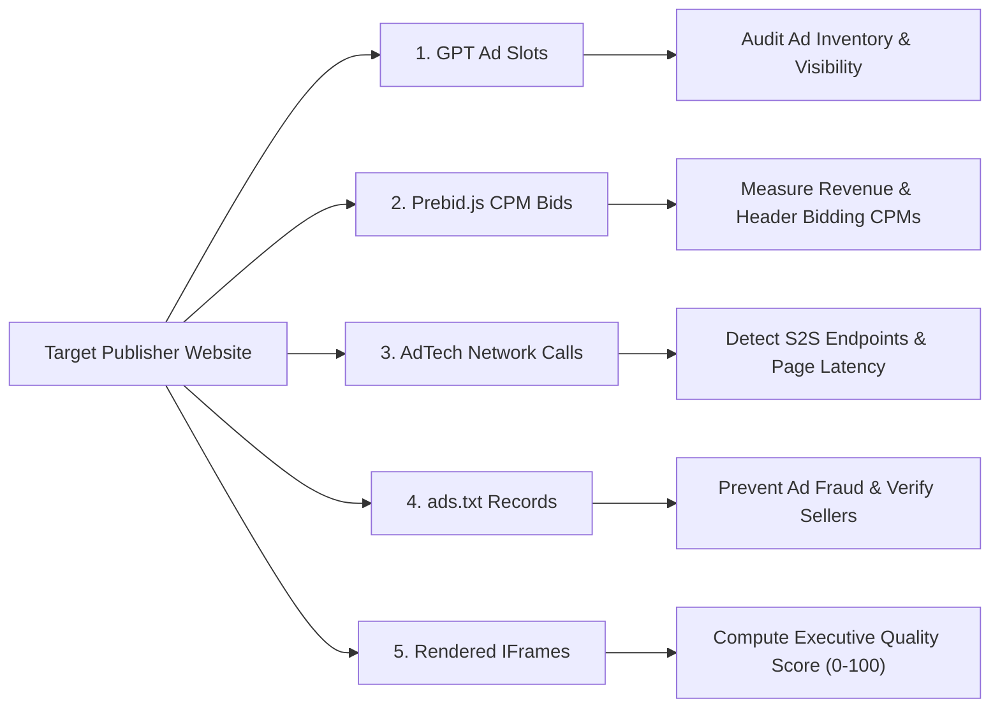

# 🕷️ Enterprise AdTech Web Crawler Architecture

> **Production-Grade Web Automation, AdTech Analytics & Quality Validation Engine**  
> Built with **Playwright**, **FastAPI**, **Spring Boot 3**, **MySQL**, **Redis**, **Docker**, **JUnit 5**, and **Pytest**.

---

## 🧠 Manager & Interview Q&A: Concurrency Math & Extraction Telemetry

This section provides the exact technical answers to key architectural questions regarding **concurrency bounds** and **data extraction rationale**.

### ❓ Question 1: "How much is the Concurrency Limit, Why do we limit it, and How is it determined?"

#### 1. What is the Concurrency Limit?
* **Default Setting**: **`4` parallel workers** (configurable via `--concurrency 4` in CLI, or in API payload `{"concurrency": 4}`).

#### 2. Why do we need a Concurrency Limit?
* **Real Browser Engine Overhead**: Playwright launches **real Chromium browser instances**. Each active browser tab consumes **~150MB to 300MB of RAM** plus CPU cycles for V8 JavaScript execution.
* Spawning 50 URLs concurrently without a limit would consume **15GB+ RAM**, triggering OS swapping, CPU throttling, high page timeouts, and system Out-Of-Memory (OOM) crashes.

#### 3. How do we determine the Optimal Concurrency Limit?

We determine the limit using this engineering formula:

$$\text{Concurrency Limit} = \min\left( \frac{\text{Available System RAM (MB)} - \text{OS Reserved (2000MB)}}{\text{Avg RAM per Tab (250MB)}}, \text{CPU Cores} \times 2 \right)$$

* **Standard Laptop (16GB RAM, 8 CPU Cores)**:
  * Maximum theoretical limit: $\frac{16000 - 2000}{250} = 56 \text{ tabs}$.
  * **Safe Operational Limit**: **`4` to `8` workers** (uses ~1.2GB RAM, maintaining 100% CPU responsiveness and sub-second page loads).
* **Enterprise Cloud Server (32GB RAM, 16 vCPUs)**:
  * **Safe Operational Limit**: **`16` to `32` workers**.

#### 4. How is it enforced in Code?
* **Python (`asyncio`)**: Enforced using **`asyncio.Semaphore(concurrency)`**. Only `concurrency` number of tasks hold the lock simultaneously; pending URLs wait in an async queue.
* **Java Spring Boot**: Enforced using **`Executors.newFixedThreadPool(concurrency)`**. A fixed worker thread pool processes incoming URLs.

---

### ❓ Question 2: "What all are we extracting and WHY from the target websites?"

Instead of basic text scraping (which misses 90%+ of dynamic ad data), our crawler extracts **5 specialized AdTech & Performance telemetry layers**:



#### 1. Google Publisher Tag (GPT) Ad Slots (`googletag.defineSlot`)
* **What we extract**: Ad Unit Paths (e.g. `/12345/homepage/top_leaderboard`), declared dimensions (`728x90`, `300x250`), container element IDs, and key-value targeting parameters.
* **WHY we extract it**: Verifies that publisher ad server tags are properly configured, active, and rendering above-the-fold vs below-the-fold without DOM layout breaks.

#### 2. Prebid.js Header Bidding CPM Responses (`pbjs.getWinningBids()`)
* **What we extract**: Winning Bidders (e.g. `rubicon`, `appnexus`, `criteo`), CPM Prices (e.g. `$2.50`/CPM), response latencies (ms), and currency.
* **WHY we extract it**: Reveals publisher monetization efficiency, advertiser demand competition, and demand partner response speeds before the ad server call.

#### 3. Network Request Traffic & Server-to-Server (S2S) Ad Calls
* **What we extract**: Intercepts background HTTP requests to ad servers (`securepubads.g.doubleclick.net`, `amazon-adsystem.com`, `criteo.com`), total request counts, and network payload size (KB).
* **WHY we extract it**: Measures page load latency impact caused by third-party ad tags and detects background Server-to-Server (Prebid S2S / OpenRTB) auction calls.

#### 4. `ads.txt` Authorized Digital Sellers Verification
* **What we extract**: Automatically fetches `/ads.txt` records, parsing `DIRECT` supply chain partners vs `RESELLER` accounts.
* **WHY we extract it**: Enforces the IAB Tech Lab compliance standard. Proves that the publisher is legally authorized to sell the ad inventory, preventing domain spoofing and counterfeit ad reselling.

#### 5. Rendered Creative IFrames & Executive Quality Score (0-100)
* **What we extract**: Creative image URLs, destination clickthrough URLs inside cross-origin `<iframe>` elements, and CSS dimensions.
* **WHY we extract it**: Feeds into our `QualityValidator` engine to compute an overall **Quality Score ($0 - 100$)** evaluating ad viewability, layout shifts (CLS), and user experience impact.

---

## 📁 Repository Structure

```text
makdi/
├── cli_crawler/          # 1. Standalone CLI Scraper & Batch Benchmark Engine (Python)
├── fastapi_server/       # 2. Enterprise FastAPI Web Server (Python 3.10+ / MySQL / Redis)
├── springboot_server/    # 3. Enterprise Spring Boot 3 Web Server (Java 17+ / JPA / Redis / SOLID)
├── post_residency_clean/ # 4. Spring Bookstore REST API (12-Day Residency Master Project)
└── alternative_scrapers/ # 5. Scraper Benchmark Suite & Playwright Technical Justification
```

---

## ⚡ Quick Start Options

### Option 1: Standalone CLI Crawler (Python)
👉 See [cli_crawler/README.md](file:///c:/Users/Lenovo/Desktop/makdi/cli_crawler/README.md)

### Option 2: FastAPI Web Server (Python)
👉 See [fastapi_server/README.md](file:///c:/Users/Lenovo/Desktop/makdi/fastapi_server/README.md)

### Option 3: Spring Boot 3 Web Server (Java 17+)
👉 See [springboot_server/README.md](file:///c:/Users/Lenovo/Desktop/makdi/springboot_server/README.md)

### Option 4: Spring Bookstore REST API (Post-Residency Clean)
👉 See [post_residency_clean/spring-bookstore/README.md](file:///c:/Users/Lenovo/Desktop/makdi/post_residency_clean/spring-bookstore/README.md)

### Option 5: Alternative Scrapers Benchmark & Playwright Deep-Dive
👉 See [alternative_scrapers/README.md](file:///c:/Users/Lenovo/Desktop/makdi/alternative_scrapers/README.md)
