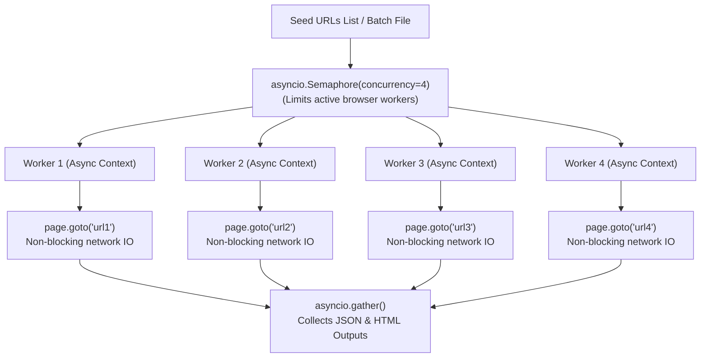

# 🕷️ Forbes AdTech Asynchronous CLI Web Crawler

> **High-Performance Parallel Async Web Crawler & AdTech Analytics Engine**  
> Built with **Python 3.10+**, **Playwright Async API**, **Asyncio Concurrency Control**, **BeautifulSoup4**, **Jinja2 Reporting**, and **Validator Scoring Engine**.

---

## ⚡ How Asynchronous Parallel Crawling Works in Code

Understanding how async concurrency operates in this codebase is key to explaining the architecture:



### 1. The Core Async Architecture (`batch_crawler.py`)
In `batch_crawler.py`, parallel batch execution uses Python's `asyncio.Semaphore` and `asyncio.gather()`:

```python
# Extract from batch_crawler.py
semaphore = asyncio.Semaphore(self.concurrency)

async def crawl_with_semaphore(url: str):
    async with semaphore:  # Bounded concurrency lock
        crawler = ForbesAdTechCrawler(headless=self.headless, output_dir=self.output_dir)
        return await crawler.crawl(url)

# Execute all URL tasks concurrently in parallel
tasks = [crawl_with_semaphore(url) for url in urls]
results = await asyncio.gather(*tasks, return_exceptions=True)
```

### 2. Why Async Concurrency is Superior
* **Non-Blocking Network I/O**: While one browser tab is waiting for network DNS/TLS or ad scripts to load, Python's `asyncio` event loop yields execution to process DOM extractions on another tab.
* **Bounded Memory Control (`Semaphore`)**: Setting `--concurrency 4` guarantees that no more than 4 browser contexts run simultaneously, preventing system memory overflow.
* **Isolated Browser Contexts**: Each worker thread creates an isolated `browser.new_context()`, ensuring zero session crosstalk or cookie leaks between target publishers.

---

## 🛠️ How to Customize URLs & Concurrency Parameters

### Option 1: Crawl a Single Custom URL
To crawl any custom URL on demand:

```bash
cd cli_crawler
python main.py --url https://www.yourcustomwebsite.com
```

---

### Option 2: Crawl a Custom Batch URL File
1. Create a text file named `my_targets.txt` inside `cli_crawler/` containing one URL per line:
   ```text
   # my_targets.txt
   https://www.forbes.com
   https://www.bloomberg.com
   https://www.reuters.com
   https://www.techcrunch.com
   https://www.wsj.com
   ```

2. Run the batch crawler specifying your custom file and desired concurrency level (`--concurrency`):
   ```bash
   python main.py --batch my_targets.txt --concurrency 5
   ```

---

### Option 3: Run the Built-In 20-Publisher Benchmark Suite
To run the automated benchmark suite across 20 top global publishers:

```bash
python main.py --test-20 --concurrency 4
```

To modify the default 20 benchmark URLs, edit the `TEST_20_URLS` list in `batch_crawler.py`:

```python
# File: batch_crawler.py
TEST_20_URLS = [
    "https://www.forbes.com",
    "https://edition.cnn.com",
    "https://techcrunch.com",
    "https://www.businessinsider.com",
    "https://www.theverge.com",
    # Add your custom target URLs here...
]
```

---

## 🚀 Step-by-Step Setup & Execution Instructions

### Step 1: Navigate to Project Directory
```bash
cd cli_crawler
```

### Step 2: Install Dependencies
```bash
pip install -r requirements.txt
playwright install chromium
```

### Step 3: Available CLI Command Flags

| Flag | Argument | Default | Description |
| :--- | :--- | :--- | :--- |
| `--url` | `STRING` | `https://www.forbes.com` | Crawl a single target website URL. |
| `--batch` | `FILE_PATH` | `None` | Path to text file containing target URLs line by line. |
| `--concurrency` | `INTEGER` | `4` | Number of parallel async worker slots. |
| `--test-20` | `FLAG` | `False` | Run automated benchmark suite across 20 top publishers. |
| `--output-dir` | `PATH` | `./output` | Output directory for JSON dumps and HTML dashboards. |
| `--headful` | `FLAG` | `False` | Run browser in visual headful mode (UI window visible). |

---

## 📊 Extracted Outputs & Analytics

Upon crawl completion, output files are generated inside `./output`:

* **JSON Analytics Dumps**: `./output/result_<domain>_<timestamp>.json`
* **Interactive HTML Dashboards**: `./output/report_<domain>_<timestamp>.html`
* **Ad Slot Creative Screenshots**: `./output/screenshots/`

### Console Output View
```text
=================================================================
                 EXECUTIVE CRAWL SUMMARY
=================================================================
 Quality Rating        : EXCELLENT (Score: 100/100)
 GPT Ad Slots Found    : 7
 AdTech Calls Captured : 395
 ads.txt Direct Partners: 58
 JSON Result File      : ./output/result_www.forbes.com_20260810.json
 Interactive Dashboard : ./output/report_www.forbes.com_20260810.html
=================================================================
```

---

## 🔍 Code Walkthrough for Code Reviews & Interviews

When explaining the code during reviews or interviews, highlight these core files:

1. **`main.py`**: CLI entry point utilizing `argparse` to parse flags (`--url`, `--batch`, `--concurrency`, `--test-20`).
2. **`crawler.py` (`ForbesAdTechCrawler`)**: Main Playwright driver setup, network response listener (`page.on("response")`), asset route blocking (`page.route()`), and DOM extractor calls.
3. **`batch_crawler.py` (`BatchAdTechCrawler`)**: Asynchronous parallel runner managing worker pools via `asyncio.Semaphore` and `asyncio.gather()`.
4. **`extractors/` Directory**: Modular parameter extraction routines (`dom_extractor.py`, `gpt_extractor.py`, `prebid_extractor.py`, `performance_extractor.py`).
5. **`validator.py` (`QualityValidator`)**: Scoring algorithm computing quality scores ($0-100$) based on ad density, layout reflow, and response speeds.
6. **`reporter.py` (`ReportGenerator`)**: Jinja2 template renderer compiling data into dark-mode interactive HTML reports.
