# Executive Master Architecture & Deep Technical Specification: Web Scraping, Browser Automation & Anti-Bot Evasion

> **Document Type**: Single Master Architectural Specification & Reference Manual.  
> **Target Audience**: Lead Data Engineers, Systems Architects, and Security Researchers.  
> **Scope**: Complete end-to-end breakdown of web data acquisition, browser internals, multi-process Chromium architecture, Browser Context isolation, document rendering, networking protocols, framework ecosystem evaluation (Pros & Cons), Playwright supremacy deep-dive, 5-layer anti-bot evasion stack, and maximum volume ad-tech data extraction.

---

## 1. Web Data Acquisition Paradigms & Core Mechanics

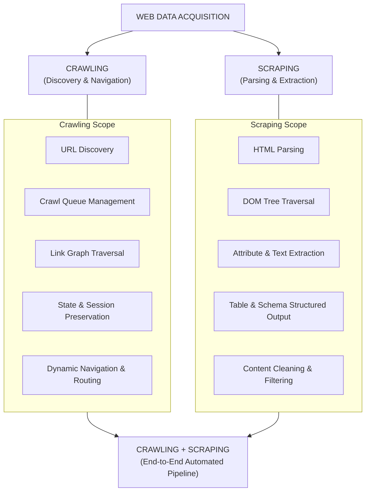

### 1.1 Web Scraping (Data Extraction Layer)
* **Definition**: The passive or targeted phase of data acquisition that parses already-retrieved HTML/XML/JSON payloads into clean, structured schemas.
* **Core Operations**: Constructing DOM tree representations, executing CSS selectors / XPath expressions, normalizing text, decoding HTML entities (`&amp;`, `&lt;`), extracting tabular data (`<table>`), pulling anchor links (`<a href="...">`), and harvesting metadata (`data-*`, `meta`, Open Graph).
* **Execution Boundary**: Operates directly on static markup strings; does **not** execute client-side JavaScript, compute CSS layouts, or fire browser lifecycle events.

### 1.2 Web Crawling (Discovery & Navigation Layer)
* **Definition**: The active, stateful traversal of web hyperlink graphs to discover URLs, manage navigation pipelines, handle network transport dynamics, and preserve session state.
* **Core Operations**: Outbound link discovery, URL Frontier priority queue scheduling, visited URL deduplication (Bloom filters), `robots.txt` rate limit enforcement, pagination handling ("Next Page", `?page=N`), HTTP redirect resolution (`301`, `302`), and authentication token preservation.

### 1.3 Traditional HTTP Scraping vs. Headless Browser Crawling

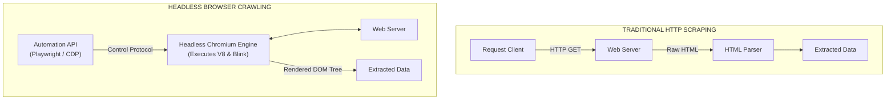

### 1.4 Architectural Comparison Matrix

| Feature / Dimension | Traditional HTTP Crawling | Headless Browser Crawling |
| :--- | :--- | :--- |
| **Execution Model** | Single HTTP Request-Response exchange. | Full OS-level process lifecycle execution (Blink + V8 engines). |
| **JavaScript Execution** | ❌ None | ✅ Full V8/SpiderMonkey JS engine execution. |
| **DOM Tree Generation** | ❌ Raw HTML string only (Static). | ✅ Dynamic, live, mutable DOM representation. |
| **Network Requests Made** | 1 request per target document. | 50–200+ sub-requests per page (CSS, JS, Fonts, Images, XHR/Fetch). |
| **Memory Footprint** | Extremely low (~5MB–20MB per worker thread). | Heavy (~150MB–500MB+ per browser context/process). |
| **CPU Overhead** | Minimal (I/O bound parsing). | High (CPU bound rendering, layout calculation, JS JIT). |
| **Crawl Throughput** | Thousands of pages per minute per core. | Tens of pages per minute per core. |
| **Anti-Bot Susceptibility**| High (easily flagged by missing browser headers/TLS fingerprints). | Low-to-Moderate (presents real browser signatures, though CDP flags exist). |
| **API / Resource Interception**| Limited to raw HTTP response parsing. | Native network interception, request blocking, response mocking. |

### 1.5 When Headless Browser Crawling Is Essential vs. Traditional Scraping
* **Headless Browsers Required**: JavaScript-heavy Single Page Applications (React, Vue, Angular, Svelte), client-side pre-rendered hydration, interactive content triggers (clicks, accordions), infinite scroll feeds (`IntersectionObserver`), canvas/WebGL rendering, and client-side payload encryption inside V8.
* **Traditional HTTP Superior**: Static HTML pages, server-side rendered (SSR) blogs/news sites, reverse-engineered internal REST/GraphQL APIs, ultra-large-scale crawling (millions of pages), and bandwidth-constrained environments.

### 1.6 Infrastructure Resource Cost & Performance Tradeoffs

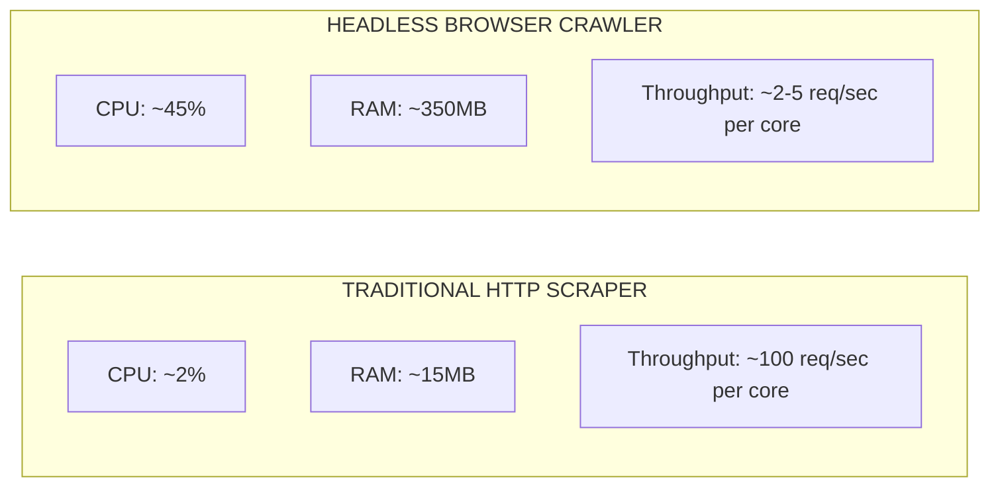

### 1.7 The Core Data Acquisition Mental Model
> **`Crawler`** $\rightarrow$ **`Playwright Automation API`** $\rightarrow$ **`Chromium Engine`** $\rightarrow$ **`Browser Context`** $\rightarrow$ **`Page`** $\rightarrow$ **`Network + HTML/CSS/JS`** $\rightarrow$ **`Live DOM Tree`** $\rightarrow$ **`Playwright Locators / API Interception`** $\rightarrow$ **`Structured Data`**

---

## 2. Browser Architecture, Engine Mechanics & Object Model Hierarchy

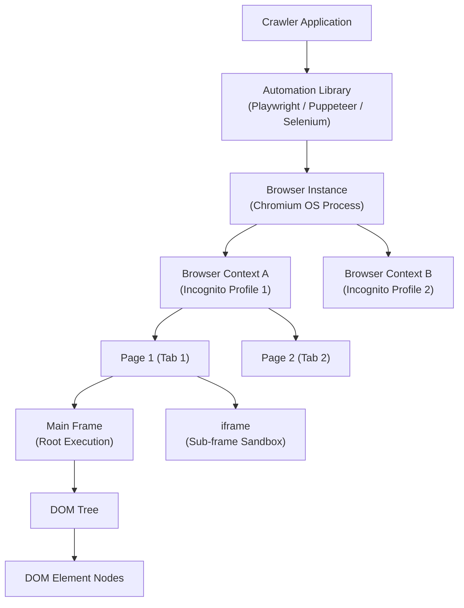

### 2.1 Scope of Headless Browser Capabilities
Automation APIs control the full capabilities of modern browser binaries:
* **Web Storage**: Cookies (Session/Persistent), LocalStorage (Origin Scope), SessionStorage (Tab Scope), IndexedDB (B-Tree Database), Cache API.
* **Data Protocols**: HTTP/1.1, HTTP/2, HTTP/3 QUIC, Fetch/XHR APIs, WebSockets (RFC 6455), Server-Sent Events (SSE).
* **UI & Interaction**: Synthetic mouse/keyboard/touch events, form controls, file uploads/downloads, native alert/confirm modals, OOPIF iframe traversal, permissions, geolocation.

### 2.2 Chromium Core Engines (Blink, V8, Skia)

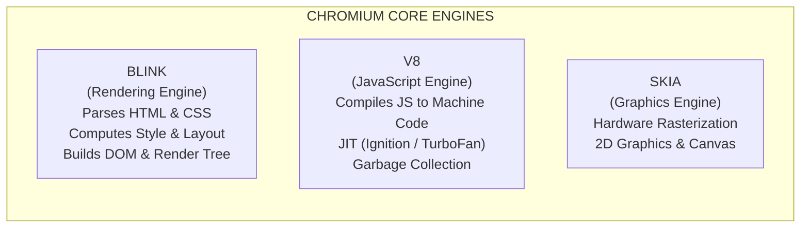

### 2.3 Chromium Multi-Process Architecture

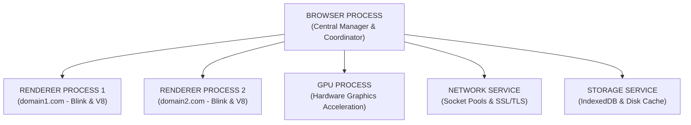

1. **Browser Process**: Manages application lifecycle, address bar, tab coordination, process creation, security permissions, and IPC message routing.
2. **Renderer Process**: Runs inside an OS-level sandbox. Executes Blink (HTML/CSS parsing) and V8 (JavaScript execution). Spawns separate processes per domain (Site Isolation).
3. **GPU Process**: Receives drawing commands from renderer processes and composites graphics onto screen buffers using DirectX, OpenGL, Vulkan, or Metal.
4. **Network Service**: Handles network requests, socket pools, HTTP/1/2/3 protocols, SSL/TLS handshakes, and caching.
5. **Storage Service**: Handles isolated disk I/O, IndexedDB transactions, and LevelDB database persistence.

### 2.4 Browser Context Isolation (In-Memory Profiles & Scaling Optimization)
A **Browser Context** represents an isolated, in-memory browser profile (equivalent to an Incognito session).

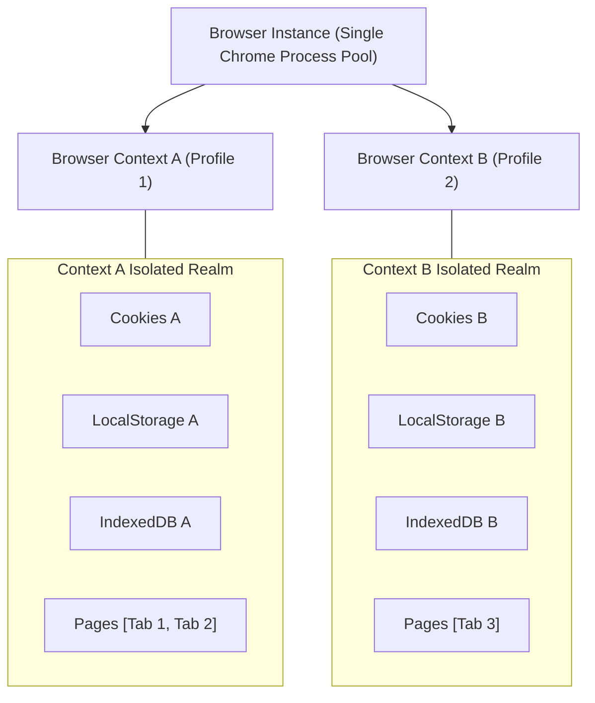

> **IMPORTANT**: **Key Optimization Rule**: `New Browser Context ≠ New Chromium Process`.  
> Creating a new Browser Context takes **milliseconds** and negligible RAM (~15MB) because it reuses the existing Chromium Browser process, GPU process, and Network Service while creating isolated state containers.

### 2.5 Frame, iframe & Out-Of-Process iframe (OOPIF) Mechanics
A **Frame** represents a document execution context. A Page contains one **Main Frame** and optional child `<iframe>` elements:
* **Same-Origin `<iframe>`**: Shares execution limits; parent scripts can directly inspect `iframe.contentDocument`.
* **Cross-Origin `<iframe>` (OOPIF)**: Rendered in a completely separate OS Renderer Process for security. Parent scripts cannot read cross-origin iframe DOM without explicit `postMessage` permissions.

### 2.6 Browser Context Isolation vs. Domain Isolation

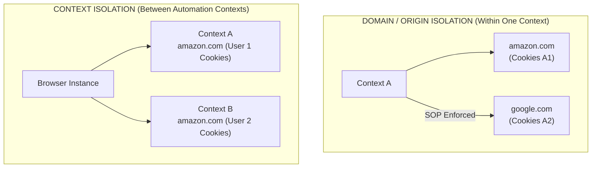

---

## 3. Document Processing, Rendering Pipeline & Client Execution

### 3.1 The Document Object Model (DOM)

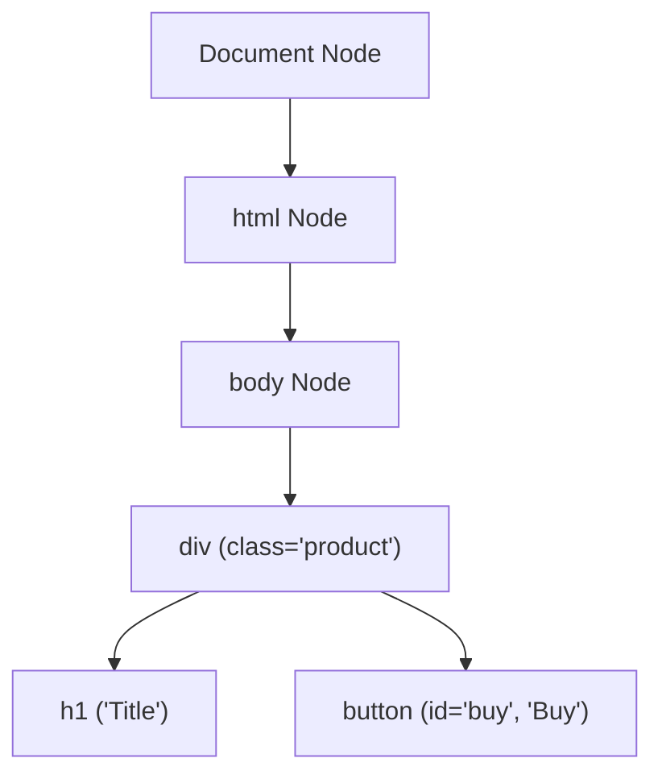

### 3.2 HTML Processing & Dynamic HTML Rendering

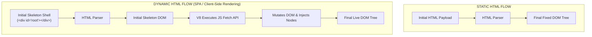

### 3.3 V8 JavaScript Engine Runtime & Async Event Loop

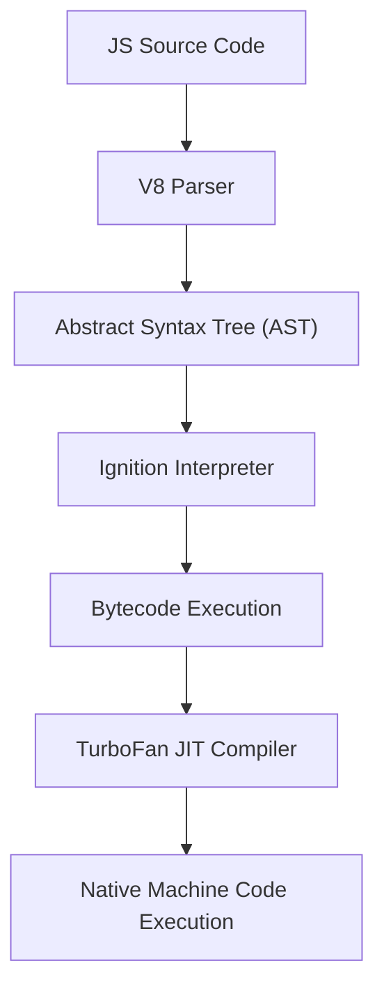

### 3.4 The 8-Stage Browser Rendering Pipeline

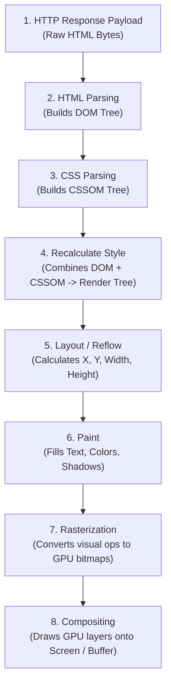

### 3.5 Web Navigation Mechanics & SPA Routing

```mermaid
flowchart TD
    subgraph HardNav["1. HARD SERVER NAVIGATION"]
        H1["Browser"] -- "New HTTP Request" --> H2["Web Server"] -- "Full HTML Response" --> H3["Full Page Refresh"]
    end

    subgraph SPANav["2. CLIENT-SIDE SPA NAVIGATION"]
        S1["User Click / Route"] --> S2["JS Intercepts"] --> S3["window.history.pushState()"] --> S4["Fetch API JSON"] --> S5["DOM Mutated in Place"]
    end

    subgraph HashNav["3. FRAGMENT / HASH NAVIGATION"]
        Z1["Navigation to #section"] --> Z2["Triggers window.onhashchange"] --> Z3["Smooth Viewport Scroll"]
    end
```

---

## 4. Networking, Transport Protocols & Interception Layer

### 4.1 Protocol Stack Infrastructure

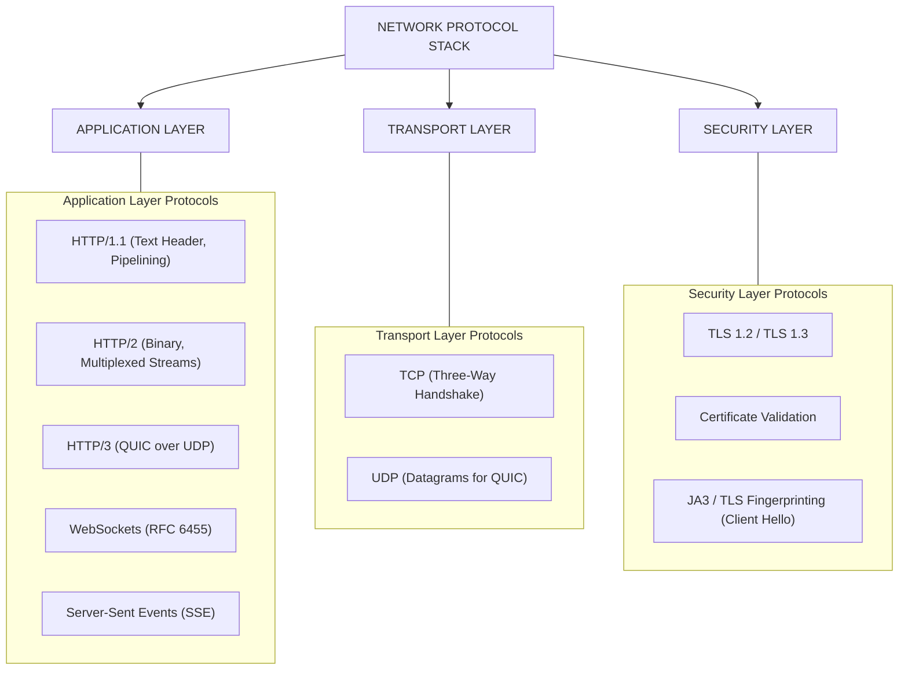

### 4.2 WebSockets (Full-Duplex Real-Time Data)

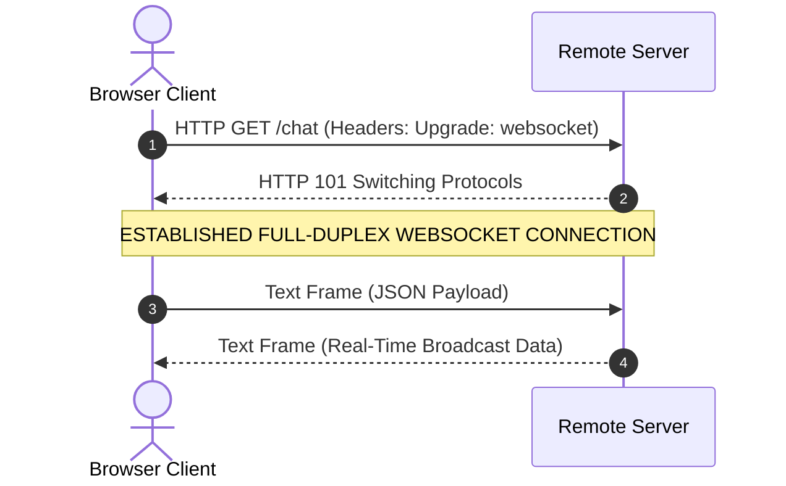

### 4.3 Network Interception & Request Routing (`page.route()`)

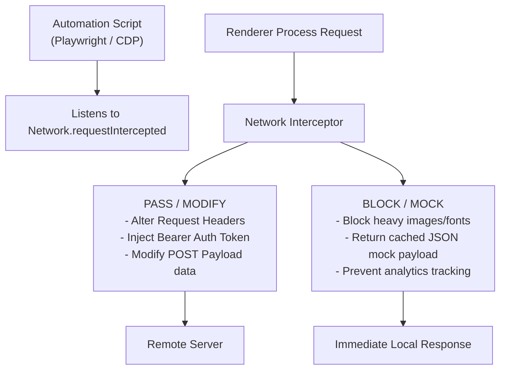

---

## 5. Storage Engines, Browser State & Security Isolation

### 5.1 Cookie Storage Engine & Security Flags
Cookies are attached to HTTP headers (`Cookie:` request header and `Set-Cookie:` response header) managed strictly by Chromium's Network Service.

```http
Set-Cookie: session_id=xyz123; Domain=.example.com; Path=/; Secure; HttpOnly; SameSite=Lax; Max-Age=86400
```

| Flag / Attribute | Functional Behavior & Scraper Impact |
| :--- | :--- |
| **Domain** | Specifies which host domains can receive the cookie (e.g., `.example.com` includes all subdomains). |
| **Path** | Restricts cookie transmission to specific URL paths (e.g., `/app`). |
| **Expires / Max-Age** | Session cookie (deleted when context closes) vs. Persistent cookie (persisted until timestamp). |
| **Secure** | Restricts cookie transmission strictly to encrypted `https://` connections. |
| **HttpOnly** | Blocks JavaScript (`document.cookie`) access. Prevents XSS theft, but scrapers cannot read it via evaluate. |
| **SameSite=Strict** | Cookie is never sent in cross-site requests (e.g., following an external link). |
| **SameSite=Lax** | Default setting. Sent on top-level navigation GET requests, but blocked on cross-site POSTs. |
| **SameSite=None** | Cookie sent on all cross-site requests (requires `Secure` flag). |

### 5.2 Storage Matrix

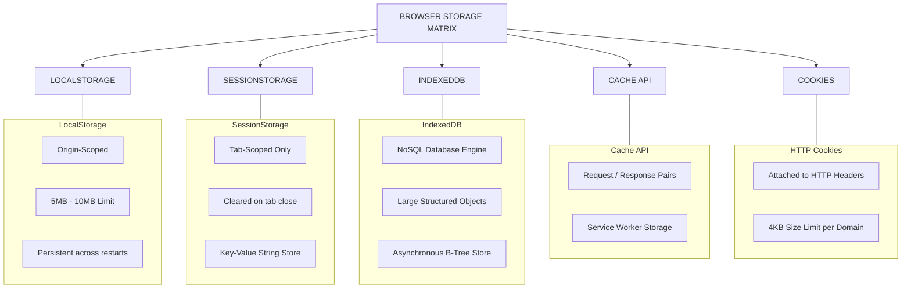

### 5.3 The 7-Level Browser Isolation Pyramid

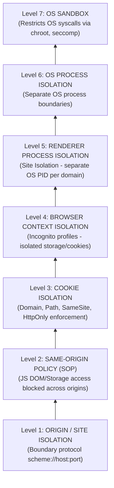

---

## 6. Dynamic Web Applications & UI Interaction Automation

### 6.1 Synthetic User Interactions

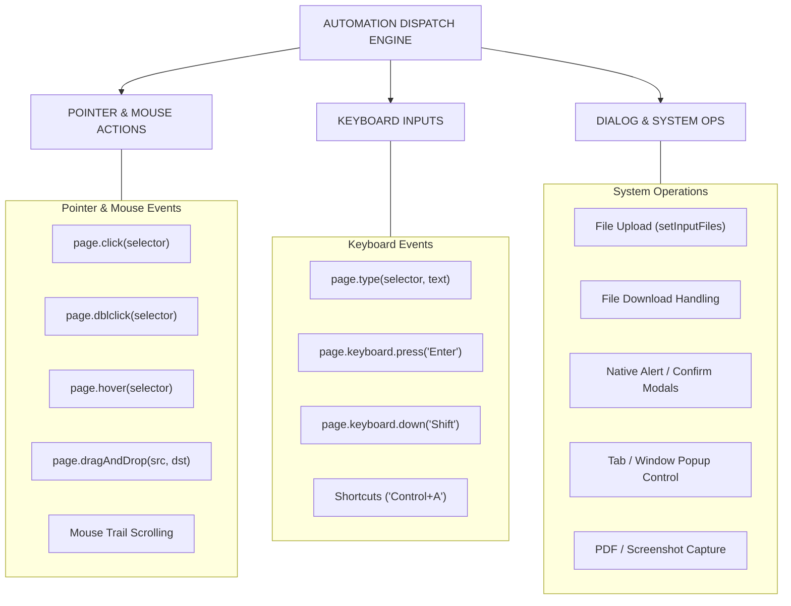

### 6.2 CSR vs. SSR & Client Hydration

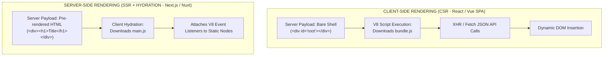

---

## 7. Crawling System Design, Traversal Strategies & State Control

### 7.1 Crawler State Architecture

```mermaid
flowchart TD
    A["CRAWLER STATE ARCHITECTURE"] --> B["URL FRONTIER"]
    A --> C["VISITED SET"]
    A --> D["QUEUE ENGINE"]
    A --> E["DEDUPLICATION ENGINE"]
    A --> F["METADATA STORE"]

    subgraph Frontier["URL Frontier"]
        B1["Discovered URLs"]
        B2["Pending Fetch List"]
        B3["Priority Scoring"]
    end

    subgraph Visited["Visited Set"]
        C1["Hashes of Crawled URLs (SHA256)"]
        C2["Bloom Filters for Fast Lookup"]
    end

    subgraph QueueEng["Queue Engine"]
        D1["Priority Queue (Redis / RabbitMQ)"]
        D2["FIFO / LIFO Task Scheduling"]
    end

    subgraph Dedup["Deduplication Engine"]
        E1["URL Normalization"]
        E2["Canonical Tag Verification"]
        E3["Tracking Parameter Stripping"]
    end

    subgraph Metadata["Metadata Store"]
        F1["HTTP Status Codes & Headers"]
        F2["Depth Level & Parent Source"]
        F3["Response Execution Time"]
    end

    B --- Frontier
    C --- Visited
    D --- QueueEng
    E --- Dedup
    F --- Metadata
```

---

## 8. Automation Framework Ecosystem & Playwright Deep-Dive

### 8.1 Complete Automation Framework Matrix & Pros/Cons Analysis

| Tool / Framework | Primary Architecture | Supported Browsers | Async Paradigm | Primary Use Case |
| :--- | :--- | :--- | :--- | :--- |
| **Playwright** | Direct IPC via CDP / Firefox / WebKit protocols | Chromium, Firefox, WebKit | Native `async/await` (Node, Python, Java, .NET) | Modern gold standard for dynamic web scraping, UI testing, and API interception. |
| **Puppeteer** | Direct Chrome DevTools Protocol (CDP) | Chromium, Chrome | JS Promises / `async/await` (Node.js) | Native Chrome automation maintained by Google; fast Node.js scraper setups. |
| **Selenium** | W3C WebDriver Protocol over HTTP REST | Chrome, Firefox, Edge, Safari | Language-dependent (Python, Java, C#, Ruby) | Legacy cross-browser automation; enterprise grid testing infrastructure. |
| **Cypress** | In-Browser Execution Proxy | Chromium, Firefox | Async Chained Commands (JS) | Front-end web application testing; restricted for general-purpose crawling. |
| **Scrapy** | Twisted Event-Driven Networking | None (Pure HTTP client) | Async Event Loop (Python) | High-throughput HTTP crawling; combined with Playwright for dynamic rendering. |

### 8.2 Detailed Framework Breakdown: Pros & Cons

#### 1. Playwright
* **Pros**: Multi-browser support (Chromium, Firefox, WebKit), fast isolated browser contexts (~15MB RAM), native auto-waiting, built-in network interception (`page.route()`), native auth state storage (`storageState()`), multi-language APIs (Python, JS, Java, .NET), visual time-travel Trace Viewer.
* **Cons**: Higher CPU/RAM usage than raw HTTP clients.

#### 2. Puppeteer
* **Pros**: Native Chrome DevTools Protocol (CDP) access, lightweight footprint for Node.js scripts, excellent screenshot and PDF rendering.
* **Cons**: Restricted to Node.js; WebKit unsupported; lacks built-in auto-waiting for complex UI elements.

#### 3. Selenium WebDriver
* **Pros**: Large legacy enterprise ecosystem, native Safari browser support, Selenium Grid for distributed machine clusters.
* **Cons**: Slower execution over HTTP REST protocol; manual `WebDriverWait` boilerplate required; heavy session isolation (requires spinning up full browser binaries).

#### 4. Cypress
* **Pros**: Outstanding developer experience for front-end testing; real-time visual DOM debugging.
* **Cons**: Unsuitable for general web crawling; strict cross-origin navigation restrictions; heavy local test overhead.

#### 5. Scrapy
* **Pros**: Unmatched HTTP speed and throughput; built-in pipelines for URL scheduling, middleware, proxy rotation, and CSV/JSON/Parquet exports.
* **Cons**: Cannot execute JavaScript or render Single Page Applications (SPAs) natively without browser plugins (`scrapy-playwright`).

### 8.3 Why Playwright Reigns Supreme: The #1 Browser Automation Tool

```mermaid
flowchart TD
    PW["PLAYWRIGHT: THE #1 AUTOMATION ENGINE"] --> C1["Unified Multi-Engine<br/>(Chromium, Firefox, WebKit)"]
    PW --> C2["Light-Speed Context Isolation<br/>(Milliseconds startup, 10x RAM efficient)"]
    PW --> C3["Smart Auto-Waiting Engine<br/>(Zero flaky sleep calls)"]
    PW --> C4["Native Network Routing & Interception<br/>(Block assets, capture JSON APIs)"]
    PW --> C5["Native Storage State Persistence<br/>(storageState auth reuse)"]
    PW --> C6["Multi-Language & Async APIs<br/>(Python asyncio, JS, Java, C#)"]
    PW --> C7["Built-in Stealth & CDP Access<br/>(Full fingerprint & header control)"]
```

### 8.4 Browser Crawling Concurrency Scaling Models

```mermaid
flowchart TD
    subgraph Strat1["Strategy 1: MULTIPLE PAGES (Same Context)"]
        B1["One Browser"] --> C1["One Context"] --> P1["Page 1, Page 2, Page 3"]
        Note1["Lowest RAM Overhead | Shared Cookie Identity"]
    end

    subgraph Strat2["Strategy 2: MULTIPLE CONTEXTS (Same Browser - RECOMMENDED)"]
        B2["One Browser"] --> C2A["Context A (Page 1)"]
        B2 --> C2B["Context B (Page 1)"]
        B2 --> C2C["Context C (Page 1)"]
        Note2["Low RAM Overhead | 100% Isolated Identity & Storage"]
    end

    subgraph Strat3["Strategy 3: MULTIPLE BROWSERS (Same Machine)"]
        B3A["Browser 1 (Context A - PID 101)"]
        B3B["Browser 2 (Context B - PID 102)"]
        Note3["High RAM Overhead | Maximum OS Process Isolation"]
    end

    subgraph Strat4["Strategy 4: DISTRIBUTED GRID (Multiple Machines)"]
        K8s["Kubernetes Cluster / Playwright Worker Nodes"] --> Worker1["Worker Node 1"]
        K8s --> Worker2["Worker Node 2"]
        Note4["Infinite Scale | High Ops Overhead"]
    end
```

### 8.5 Complete 20-Step End-to-End Playwright Crawl Workflow

```mermaid
flowchart TD
    Step1["1. Seed URL Ingestion"] --> Step2["2. Crawl Scheduler (Queue in Priority Frontier)"]
    Step2 --> Step3["3. Playwright Framework Init (async with async_playwright())"]
    Step3 --> Step4["4. Chromium Process Spawn (Headless Binary Launch)"]
    Step4 --> Step5["5. Browser Context Allocation (Isolated Incognito Profile)"]
    Step5 --> Step6["6. Page Creation (Open Target Tab)"]
    Step6 --> Step7["7. Network Interception Setup (Attach page.route / Block Assets)"]
    Step7 --> Step8["8. Navigation Dispatch (page.goto(url))"]
    Step8 --> Step9["9. Network Transport (DNS / TLS / HTTP2 GET)"]
    Step9 --> Step10["10. Subresource Load (HTML, CSS, JS Bundles)"]
    Step10 --> Step11["11. V8 Script Execution (Client JS Exec & Initial DOM)"]
    Step11 --> Step12["12. State Initialization (Populate Cookies & storageState)"]
    Step12 --> Step13["13. Rendered DOM Generation (Blink Style, Layout & Paint)"]
    Step13 --> Step14["14. Synthetic User Interactions (Clicks, Scrolls, Form Typing)"]
    Step14 --> Step15["15. Dynamic DOM Mutation Wait (Await networkidle / Locators)"]
    Step15 --> Step16["16. Data Extraction Phase (Intercept XHR JSON & locator.evaluate)"]
    Step16 --> Step17["17. Schema Mapping & Cleaning (Native Playwright Locators)"]
    Step17 --> Step18["18. Structured Storage (Write to Postgres / Parquet / S3)"]
    Step18 --> Step19["19. Link Discovery & Deduplication (Extract URLs & Check Bloom Filter)"]
    Step19 --> Step20["20. Queue Enqueue & Context Teardown (Push URLs & Close Context)"]
```

---

## 9. Stealth Anti-Bot Evasion & Advanced Data Extraction Architecture

### 9.1 The 5-Layer Anti-Bot Detection Landscape

```mermaid
flowchart TD
    Req["Inbound Scraper Request"] --> L1["Layer 1: TLS / JA4 Protocol Handshake"]
    L1 --> L2["Layer 2: IP Reputation & TCP Fingerprint"]
    L2 --> L3["Layer 3: Browser Engine & CDP Leaks"]
    L3 --> L4["Layer 4: WebGL, Canvas & Runtime Fingerprints"]
    L4 --> L5["Layer 5: Behavioral Interaction & Honeypots"]

    L5 --> Pass["ALLOWED: 200 OK + Full Data Access"]
    L1 -- Mismatch --> Block["BLOCKED: 403 Forbidden / Turnstile Captcha"]
    L3 -- CDP Leak --> Block
    L5 -- Robot Path --> Block
```

> **WARNING**: **The Coherence Rule**: Modern anti-bot security systems flag requests primarily on **mismatches between layers**. Presenting a Chrome User-Agent header while using a Python OpenSSL TLS signature or a standard Playwright CDP connection causes an instant 403 block.

### 9.2 The 5-Layer Unbreakable Stealth Stack

```mermaid
flowchart TD
    subgraph Layer1["LAYER 1: PROTOCOL & TLS MATCHING"]
        JA4["JA3 / JA4+ TLS Fingerprint Alignment<br/>(curl_cffi / uTLS)"]
        H2Set["HTTP/2 SETTINGS Frame Matching"]
    end

    subgraph Layer2["LAYER 2: ENGINE & CDP LEAK PATCHING"]
        Camoufox["Camoufox C++ Engine Spoofing"]
        Patchright["Patchright CDP Leak Fixes"]
        NoDriver["Nodriver / DrissionPage Direct CDP"]
    end

    subgraph Layer3["LAYER 3: FINGERPRINT RANDOMIZATION"]
        WebGL["WebGL / GPU Vendor Normalization"]
        Canvas["Canvas & AudioContext Noise Injection"]
        WebRTC["WebRTC IP Leak Protection"]
    end

    subgraph Layer4["LAYER 4: BEHAVIORAL HUMANIZATION"]
        Bezier["Bézier Curve Mouse Movements"]
        Cadence["Human Typing Cadence & Delays"]
        Honeypot["Honeypot Trap Avoidance"]
    end

    subgraph Layer5["LAYER 5: AI CAPTCHA SOLVING"]
        Turnstile["Vision Models / Turnstile Solvers"]
    end

    Layer1 --> Layer2 --> Layer3 --> Layer4 --> Layer5
```

### 9.3 Behavioral Humanization (Bézier Curves)

```mermaid
flowchart LR
    Start["Action Request"] --> Bezier["Generate Bézier Curve Trajectory"]
    Bezier --> Jitter["Inject Natural Micro-Jitter & Speed Curves"]
    Jitter --> Hover["Hover Element & Await Actionability"]
    Hover --> Delay["Randomized Human Delay (50ms - 250ms)"]
    Delay --> Click["Dispatch Pointer Events (down -> up -> click)"]
```

### 9.4 Maximum Data Volume Extraction Engine (Ad Tech, Google Ads, `window.dataLayer`)

```mermaid
flowchart TD
    Browser["Patchright / Camoufox Engine"] --> Target["Target Web Application"]

    subgraph DataSources["COMPREHENSIVE DATA EXTRACTION TARGETS"]
        DOMData["1. Live Rendered DOM Tree<br/>(Visible Text, Tables, Links)"]
        APIResponse["2. Background XHR / Fetch JSON<br/>(Interception via page.on('response'))"]
        AdTech["3. Ad Tech & Tracking Data<br/>(Google Ads, DoubleClick, window.dataLayer)"]
        InlineState["4. Inline Application State<br/>(__NEXT_DATA__, Redux, JSON-LD)"]
        Frames["5. Shadow DOM & OOPIF iframes<br/>(Embedded Ads & Widgets)"]
    end

    Target --> DataSources

    DataSources --> Normalizer["Data Normalizer & Schema Mapper"]
    Normalizer --> Storage["Data Warehouse<br/>(PostgreSQL / Parquet / S3)"]
```

### 9.5 Production Master Stealth Scraper Code Implementation

```python
import asyncio
import json
from patchright.async_api import async_playwright

async def run_stealth_scraper(target_url: str):
    async with async_playwright() as p:
        # Launch patched Chromium binary with stealth args
        browser = await p.chromium.launch(
            headless=True,
            args=[
                "--disable-blink-features=AutomationControlled",
                "--no-sandbox",
                "--disable-setuid-sandbox",
                "--disable-infobars",
                "--window-size=1920,1080",
            ]
        )
        
        # Create isolated browser context with real desktop signatures
        context = await browser.new_context(
            viewport={"width": 1920, "height": 1080},
            user_agent="Mozilla/5.0 (Windows NT 10.0; Win64; x64) AppleWebKit/537.36 (KHTML, like Gecko) Chrome/124.0.0.0 Safari/537.36",
            locale="en-US",
            timezone_id="America/New_York",
            geolocation={"latitude": 40.7128, "longitude": -74.0060},
            permissions=["geolocation"]
        )

        page = await context.new_page()

        # Data collection buckets
        captured_apis = []
        captured_ads = []

        # 1. Network Interception: Capture API JSON responses & Ad Network requests
        async def handle_response(response):
            url = response.url
            content_type = response.headers.get("content-type", "")

            # Capture backend JSON API payloads
            if "application/json" in content_type and "/api/" in url:
                try:
                    data = await response.json()
                    captured_apis.append({"url": url, "payload": data})
                except Exception:
                    pass

            # Capture Ad Tech requests (Google Ads, DoubleClick, Tracking)
            if any(ad_domain in url for ad_domain in ["googlesyndication", "doubleclick", "adservice", "taboola"]):
                captured_ads.append({"ad_url": url, "status": response.status})

        page.on("response", handle_response)

        # 2. Block heavy images to boost crawl speed while preserving JS/Ad scripts
        await page.route("**/*.{png,jpg,jpeg,gif,webp,woff2}", lambda route: route.abort())

        # 3. Navigate to target URL
        print(f"[*] Navigating to {target_url} with Patchright stealth engine...")
        await page.goto(target_url, wait_until="domcontentloaded", timeout=60000)

        # 4. Human Behavior Simulation (Natural Scrolling & Delays)
        for _ in range(3):
            await page.evaluate("window.scrollBy(0, 500)")
            await asyncio.sleep(0.5)

        # 5. Extract Inline State (__NEXT_DATA__ or dataLayer)
        next_data = await page.evaluate("""() => {
            const el = document.getElementById('__NEXT_DATA__');
            return el ? JSON.parse(el.textContent) : null;
        }""")

        data_layer = await page.evaluate("""() => window.dataLayer || []""")

        # 6. Extract Ad Elements & Outbound Links
        ad_elements = await page.locator("iframe[src*='google'], div[id*='ad'], div[class*='ad-slot']").all_text_contents()
        links = await page.locator("a[href]").evaluate_all("els => els.map(e => e.href)")

        # Compile Master Extraction Payload
        output_payload = {
            "target_url": target_url,
            "next_data_state": next_data,
            "data_layer_events": data_layer,
            "captured_apis_count": len(captured_apis),
            "captured_ads_count": len(captured_ads),
            "ad_text_snippets": ad_elements,
            "discovered_links_count": len(links),
        }

        print("[+] Data Extraction Complete!")
        print(json.dumps(output_payload, indent=2)[:1000])

        await context.close()
        await browser.close()

if __name__ == "__main__":
    asyncio.run(run_stealth_scraper("https://example.com"))
```

### 9.6 Architectural Comparison of Modern Stealth Engines

| Feature / Tool | Playwright (Standard) | Patchright | Camoufox | Nodriver |
| :--- | :--- | :--- | :--- | :--- |
| **CDP Leak Protection** | ❌ Leaks `Runtime.enable` | ✅ Patched | ✅ N/A (Firefox engine) | ✅ Direct CDP, No Driver |
| **Engine Source Modification**| ❌ No | ❌ JS wrappers | ✅ C++ Firefox source spoofed | ❌ CDP Python wrapper |
| **Multi-Browser Support** | Chromium, Firefox, WebKit | Chromium | Firefox | Chromium |
| **Auto-Waiting & Locators**| ✅ Native | ✅ Native | ✅ Native | ⚠️ Custom locator syntax |
| **Primary Anti-Bot Target** | Low / Medium security | Medium / High (DataDome) | Extreme (Cloudflare, Kasada) | Medium / High security |

---

## 10. Master Architectural Blueprint

```mermaid
flowchart LR
    Crawler["Crawler Engine"] --> Patchright["Patchright / Camoufox Engine"] --> JA4Proxy["JA4 TLS Match + Residential Proxy"] --> Context["Browser Context"] --> Page["Page Tab"]
    Page --> Network["Network Subresources & Ad Networks"] --> Interception["API JSON Interception & Ad Tech Extractor"] --> LiveDOM["Live DOM & Inline State"] --> Pipeline["Data Warehouse Pipeline"]
```
