# 00 - Master Index: Web Scraping & Browser Crawling Architecture

> **NOTE**: Google Docs Export Version (Formatted for pasting as document tabs).
> **Directory**: `c:\Users\Lenovo\Desktop\makdi\google_docs_export`
> **Architecture Structure**: 9 Categorized Modules + Master Index.
> **Total Key Points Covered**: 55 Core Points + 300+ Sub-points + Advanced Anti-Bot Stealth Architecture.

---

## 🗺️ Master Navigation & Module Structure

```mermaid
flowchart TD
    Index["MASTER KNOWLEDGE MAP"] --> M1["MODULE 01: ACQUISITION PARADIGMS"]
    Index --> M2["MODULE 02: BROWSER ARCHITECTURE"]
    Index --> M3["MODULE 03: RENDERING & EXECUTION"]
    Index --> M4["MODULE 04: NETWORKING & INTERCEPTION"]
    Index --> M5["MODULE 05: STORAGE & ISOLATION"]
    Index --> M6["MODULE 06: DYNAMIC APPS & UI"]
    Index --> M7["MODULE 07: CRAWL SYSTEM DESIGN & STATE"]
    Index --> M8["MODULE 08: TOOLS & CONCURRENCY"]
    Index --> M9["MODULE 09: STEALTH & ANTI-BOT ARCHITECTURE"]

    subgraph M1_Content["Module 01 Scope"]
        M1_1["Scraping vs Crawling"]
        M1_2["HTTP Scraping vs Browser Crawling"]
        M1_3["Resource Costs (CPU/RAM/Throughput)"]
        M1_4["Core Mental Model Framework"]
    end

    subgraph M2_Content["Module 02 Scope"]
        M2_1["Chromium Multi-Process IPC"]
        M2_2["Blink, V8 & Skia Core Engines"]
        M2_3["Browser Contexts vs Pages vs Frames"]
        M2_4["Context vs Domain Isolation"]
    end

    subgraph M3_Content["Module 03 Scope"]
        M3_1["DOM Tree Parsing & Selectors"]
        M3_2["8-Stage Rendering Pipeline"]
        M3_3["V8 JIT & Async Event Loop"]
        M3_4["Web APIs & Navigation Types"]
    end

    subgraph M4_Content["Module 04 Scope"]
        M4_1["Network Stack (HTTP2/3, TLS, QUIC)"]
        M4_2["WebSockets & Server-Sent Events"]
        M4_3["Subresource Loading Priorities"]
        M4_4["Request Routing & Interception"]
    end

    subgraph M5_Content["Module 05 Scope"]
        M5_1["Cookies (SameSite, HttpOnly, Secure)"]
        M5_2["LocalStorage, SessionStorage, DB"]
        M5_3["7-Level Browser Isolation Pyramid"]
        M5_4["Web Security (SOP, CORS, CSP)"]
    end

    subgraph M6_Content["Module 06 Scope"]
        M6_1["Synthetic Event Dispatching"]
        M6_2["Form Submissions & File Uploads"]
        M6_3["React/Vue SPAs & CSR Mechanics"]
        M6_4["Next.js SSR & Hydration"]
    end

    subgraph M7_Content["Module 07 Scope"]
        M7_1["URL Frontier & Priority Queue"]
        M7_2["Visited Sets & Bloom Filters"]
        M7_3["Crawl Traversal (BFS, DFS, Sitemap)"]
        M7_4["URL Deduplication & Normalization"]
    end

    subgraph M8_Content["Module 08 Scope"]
        M8_1["Automation Tools Pros & Cons"]
        M8_2["Why Playwright Reigns Supreme"]
        M8_3["Concurrency Scaling (Pages/Contexts)"]
        M8_4["20-Step End-to-End System Flowchart"]
    end

    subgraph M9_Content["Module 09 Scope"]
        M9_1["JA3 / JA4+ TLS Fingerprint Matching"]
        M9_2["Patchright & Camoufox Stealth Engines"]
        M9_3["Bézier Behavioral Humanization"]
        M9_4["Ad Tech, Tracking Pixels & Max Data Extraction"]
    end

    M1 --- M1_Content
    M2 --- M2_Content
    M3 --- M3_Content
    M4 --- M4_Content
    M5 --- M5_Content
    M6 --- M6_Content
    M7 --- M7_Content
    M8 --- M8_Content
    M9 --- M9_Content
```

---

## 📚 Complete Categorization Index (Google Docs Tabs Guide)

Below is the definitive index mapping every curated point to its target tab file:

### Tab 01: Data Acquisition Paradigms & Tradeoffs
* **Point 1**: Web Data Acquisition (Scraping vs Crawling vs Combined)
* **Point 2**: Traditional Scraping vs Browser Crawling
* **Point 50**: Architectural Comparison Matrix: Browser Crawling vs. HTTP Crawling
* **Point 51**: When Headless Browser Crawling Is Essential
* **Point 52**: When Traditional HTTP Scraping Is Superior
* **Point 53**: Resource Cost & Performance Tradeoffs
* **Point 55**: The Core Mental Model

### Tab 02: Browser Architecture & Object Model Hierarchy
* **Point 3**: The Scope of Browser Crawling Capabilities
* **Point 4**: Browser Crawling Hierarchy
* **Point 5**: The Browser Instance
* **Point 6**: Chromium Architecture & Internal Engines (Blink, V8, Skia)
* **Point 7**: Multi-Process Architecture (Browser Process, Renderer, GPU, Network Service)
* **Point 8**: Browser Context (Isolated Profiles)
* **Point 9**: Page (Tabs & Documents)
* **Point 10**: Frame & iframe Mechanics (OOPIF Out-Of-Process iframes)
* **Point 42**: Browser Hierarchy Component Matrix
* **Point 43**: Browser Context Isolation vs. Domain Isolation

### Tab 03: Document Processing, Rendering Pipeline & Client Execution
* **Point 11**: The Document Object Model (DOM) Tree & Selectors
* **Point 12**: HTML Processing & Dynamic HTML Parsing
* **Point 13**: CSS Processing & Layout Computation
* **Point 14**: JavaScript Engine Runtime (V8 Internals & Event Loop)
* **Point 15**: Browser Web APIs Exposed to JavaScript
* **Point 44**: The 8-Stage Browser Rendering Pipeline
* **Point 45**: The Browser Event System (UI, Lifecycle, DOM, Network)
* **Point 46**: Web Navigation Mechanics & SPA Routing

### Tab 04: Networking, Protocols & Interception Layer
* **Point 16**: The Network Layer Infrastructure (HTTP/1/2/3, TLS, QUIC)
* **Point 17**: The Browser Network Request Spectrum
* **Point 25**: WebSockets (Full-Duplex Real-Time Data)
* **Point 26**: Server-Sent Events (SSE / EventSource)
* **Point 47**: Subresource Loading Lifecycle & Priorities
* **Point 49**: Network Interception & Request Routing

### Tab 05: Storage Engines, Browser State & Security Isolation
* **Point 18**: Cookie Storage Engine & Security Flags (`SameSite`, `HttpOnly`, `Secure`)
* **Point 19**: LocalStorage API (`window.localStorage`)
* **Point 20**: SessionStorage API (`window.sessionStorage`)
* **Point 21**: IndexedDB Database Engine
* **Point 22**: Browser Cache & Cache API
* **Point 23**: Service Workers Architecture (Network Proxying)
* **Point 24**: Web Workers & Shared Workers
* **Point 27**: Comprehensive Browser State Management
* **Point 28**: Authentication Flows & State Persistence (`storageState`)
* **Point 29**: The 7-Level Browser Isolation Pyramid
* **Point 30**: Web Security Specifications Matrix (SOP, CORS, CSP)

### Tab 06: Dynamic Web Applications & UI Interaction Automation
* **Point 31**: Synthetic User Interactions & Automation Actions (Pointer, Keyboard, Dialogs)
* **Point 32**: Dynamic Web Frameworks, SSR & Client Hydration (React, Vue, Next.js, Nuxt)

### Tab 07: Crawling Architecture, Strategies & State Control
* **Point 33**: Crawling State Architecture & Components (Frontier, Visited Set, Bloom Filters)
* **Point 34 & 36**: Crawling Hierarchy Tree & Depth Traversal
* **Point 35**: Crawl Traversal Strategies (BFS, DFS, Sitemap, Priority Queue)

### Tab 08: Tools Ecosystem, Concurrency Models & End-to-End Systems
* **Point 37**: Complete Automation Framework Matrix & Pros/Cons Analysis (Playwright, Puppeteer, Selenium, Cypress, Scrapy)
* **Point 38**: Why Playwright Reigns Supreme: The #1 Browser Automation Tool
* **Point 39**: Playwright-Powered Hybrid Scraping Architecture
* **Point 40 & 41**: Browser Crawling Concurrency Models (Pages vs Contexts vs Browsers vs Grids)
* **Point 48**: Browser-Level Data Extraction Spectrum (16 Extraction Targets)
* **Point 54**: Complete 20-Step End-to-End Playwright Crawl Workflow

### Tab 09: Stealth Anti-Bot Evasion & Advanced Data Extraction Architecture
* **Section 1**: The Multi-Layer Anti-Bot Detection Landscape
* **Section 2**: The 5-Layer Unbreakable Stealth Stack (TLS/JA4, Patchright, Camoufox, Bézier Curves, AI Captcha Solvers)
* **Section 3**: Maximum Data Volume Extraction Architecture (Ad Tech, Google Ads, `window.dataLayer`, APIs, Inline State)
* **Section 4**: Production Master Stealth Scraper Implementation (Async Python Code)
* **Section 5**: Architectural Comparison Matrix of Modern Stealth Engines

---

## ⚡ The Ultimate Architectural Blueprint

```mermaid
flowchart LR
    Crawler["Crawler Engine"] --> Patchright["Patchright / Camoufox Engine"] --> JA4Proxy["JA4 TLS Match + Residential Proxy"] --> Context["Browser Context"] --> Page["Page Tab"]
    Page --> Network["Network Subresources & Ad Networks"] --> Interception["API JSON Interception & Ad Tech Extractor"] --> LiveDOM["Live DOM & Inline State"] --> Pipeline["Data Warehouse Pipeline"]
```

