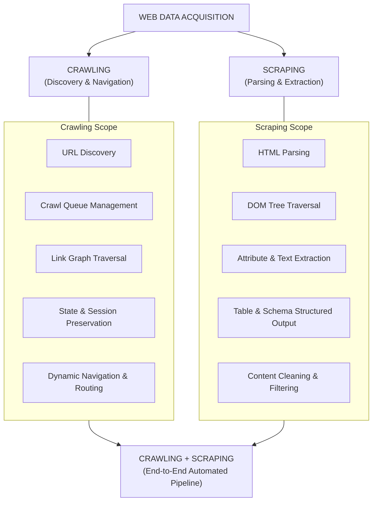
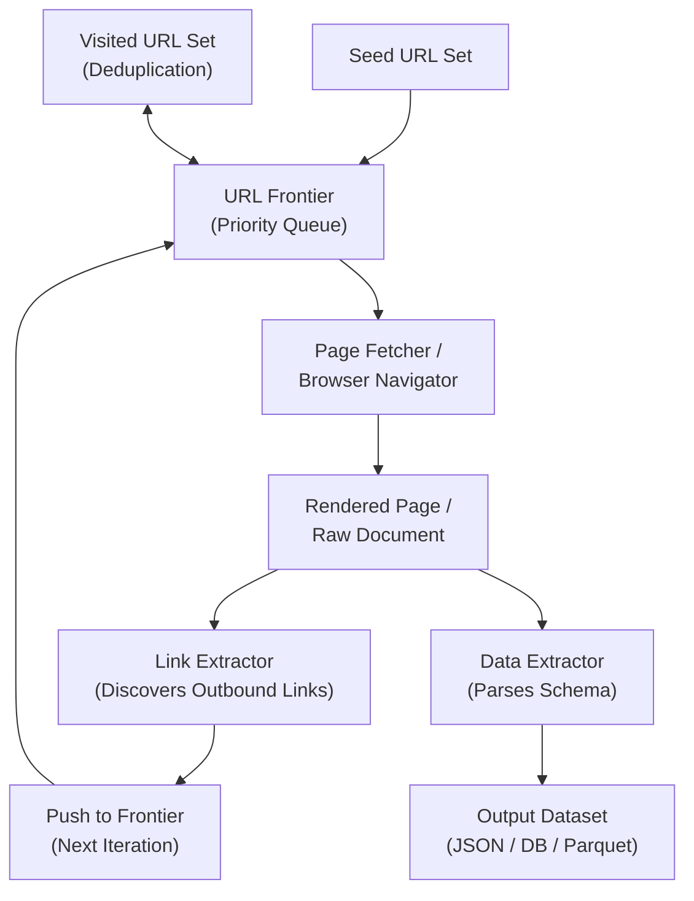
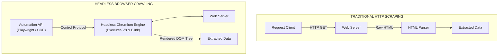
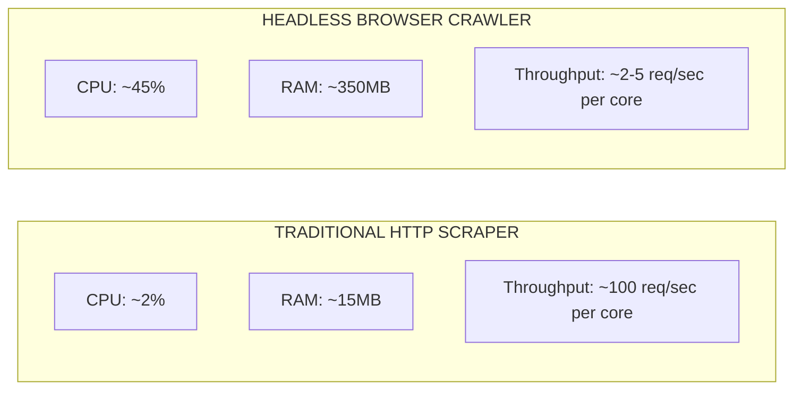
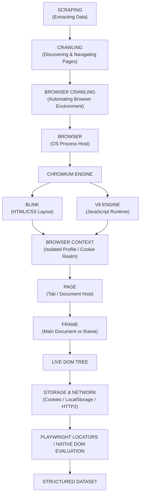

# 01 - Data Acquisition Paradigms & Tradeoffs

> **NOTE**: Google Docs Export Version (Formatted for pasting as document tabs).

## Overview
Web data acquisition encompasses the entire spectrum of techniques used to systematically collect, discover, parse, and extract information from the World Wide Web. Understanding the foundational distinctions between **Scraping**, **Crawling**, **Traditional HTTP Data Extraction**, and **Headless Browser Orchestration** is essential for designing resilient, high-throughput, and cost-effective data pipelines.

---

## 1. Web Data Acquisition Mechanics

### 1.1 Scraping (Extraction Layer)
Scraping is the passive or targeted phase of data acquisition. It assumes that raw HTML/XML content or responses have **already been retrieved** from a remote web server, and focuses entirely on structural parsing and structured field extraction.

> **NOTE**: Scraping in its pure form **does not execute JavaScript**, does not render CSS, and does not fire client-side lifecycle events. It operates directly on document trees.

#### Core Responsibilities
* **HTML/XML Document Parsing**: Constructing an in-memory Abstract Syntax Tree (AST) or Document Object Model (DOM) from raw byte streams.
* **DOM / Data Extraction**: Locating specific nodes using query languages (XPath) or selector engines (CSS selectors).
* **Text Extraction**: Stripping tags, normalizing whitespace, decoding HTML entities (`&amp;`, `&lt;`), and extracting visible text nodes.
* **Table Extraction**: Structuring tabular elements (`<table>`, `<thead>`, `<tbody>`, `<tr>`, `<td>`, `<th>`) into tabular datasets (DataFrames, JSON arrays).
* **Link Extraction**: Pulling anchor tags (`<a href="...">`), canonical tags (`<link rel="canonical">`), and media source URLs (``).
* **Attribute Extraction**: Reading non-text metadata from tags, such as `data-*` attributes, `meta` tags, open graph attributes (`og:title`), ARIA labels, and class lists.

#### Primary Parsing & Extraction Tools

| Tool / Engine | Ecosystem | Primary Mechanism & Characteristics |
| :--- | :--- | :--- |
| **Playwright Locators** | Python, JS, Java, .NET | Auto-waiting native DOM selector engine. Extracts live attributes, text, and inner HTML directly. |
| **lxml** | Python | C-based wrapper around `libxml2` and `libxslt`. Unmatched speed for high-throughput XML/HTML parsing; full XPath 1.0 support. |
| **Cheerio** | Node.js | Lightweight, fast implementation of core jQuery designed specifically for the server. Parses markup into a manipulate-able data structure. |
| **Parsel** | Python | Scrapy's standalone extraction engine built on `lxml`. Combines CSS selectors and XPath expressions with regex extraction helpers. |
| **XPath Engines** | Universal | W3C standard path language for selecting nodes in XML/HTML documents (`//div[@class='item']/a/@href`). |
| **CSS Selectors** | Universal | Pattern matching standard used to select elements based on element names, IDs, classes, pseudo-classes, and attributes (`div.item > a[href]`). |

---

### 1.2 Crawling (Discovery & Navigation Layer)
Crawling is the active, stateful traversal of web graphs. The crawler's primary objective is to discover URLs, manage navigation pipelines, handle network dynamics, and fetch pages systematically while honoring site policies and maintaining session boundaries.

#### Core Crawling Mechanics & Operations
* **URL Discovery & Frontier Management**: Parsing newly ingested documents to extract outbound hyper-links, normalizing URLs, and enqueueing unvisited links into a Crawl Queue (URL Frontier).
* **Page Retrieval**: Dispatching HTTP requests or browser navigation commands to retrieve remote resources.
* **Visited URL Tracking**: Utilizing bloom filters, hash sets, or key-value stores to guarantee deduplication and prevent infinite loops.
* **Crawl Policy Enforcement**: Parsing and respecting `robots.txt`, rate limits, crawl-delay directives, and domain scoping rules.
* **Pagination & Navigation Handling**: Automatically identifying pagination controls ("Next Page", `?page=N`, infinite scroll API triggers) to traverse deep listings.
* **Redirect & Routing Resolution**: Traversing HTTP redirects (`301`, `302`, `307`, `308`) and client-side Meta Refresh or JS redirects (`window.location.href`).
* **State & Authentication Preservation**: Managing session cookies, HTTP authorization headers, local storage tokens, and browser contexts to access restricted content.
* **Network & Transient Failure Resilience**: Handling timeouts, TCP connection resets, HTTP `429 Too Many Requests`, and `5xx` server error retry policies.
* **Client-Side Rendering (CSR) Orchestration**: When utilizing a headless browser crawler, triggering JavaScript execution engines (V8), waiting for dynamic DOM hydration, and maintaining active browser contexts.

---

### 1.3 Crawling + Scraping Integrated Pipeline

In modern web automation, Crawling and Scraping work in tandem through an asynchronous event loop:

---

## 2. Traditional HTTP Scraping vs. Headless Browser Crawling

Web extraction technologies fall into two fundamentally different architectural paradigms based on where execution occurs.

### 2.1 Traditional HTTP Scraping Architecture
Traditional scrapers issue direct HTTP requests to web servers and parse the raw response payload.

* **Typical Technology Stack**:
  * **Networking**: Python `requests`, `httpx` (async), `aiohttp`, `cURL`, Go `net/http`, Rust `reqwest`.
  * **Parsing**: `lxml`, `Parsel`, `Cheerio`.

* **Technical Limitations**:
  * **No JavaScript Engine**: Cannot execute client-side scripts, SPA frameworks (React, Vue, Angular, Svelte), or bundle assets.
  * **No DOM Representation**: Lacks a layout engine; elements hidden via CSS (`display: none`) or created dynamically by JS cannot be evaluated natively.
  * **No Browser Security API Context**: Missing native Web Crypto APIs, Canvas/WebGL rendering APIs, or hardware footprint signatures needed to solve complex client-side challenges.
  * **Manual Session & Cookie Orchestration**: Requires explicit handling of cookie jars, CSRF tokens, custom headers, and session rotation.
  * **Obfuscated / Encrypted Payloads**: Fails when data is decrypted dynamically in browser memory or obfuscated behind complex JS bundles.

---

### 2.2 Headless Browser Crawling Architecture
Headless browser crawling launches an underlying browser engine (Chromium, Firefox, WebKit) in headless mode (without a visual GUI window) and automates interactions via control protocols (DevTools Protocol or WebDriver).

* **Capabilities**:
  * Handles full client-side HTML, CSS, JavaScript, V8 runtime, and DOM computation.
  * Native storage management: Cookies, LocalStorage, SessionStorage, IndexedDB, Cache API.
  * Full networking stack: Handles HTTP/1.1, HTTP/2, HTTP/3 QUIC, WebSockets, SSE, Fetch, and XHR seamlessly.
  * Interactive UI features: Mouse movement, element clicks, form submissions, drag-and-drop, lazy-loading triggers, iframe traversal, popups, downloads.

---

## 50. Architectural Comparison Matrix: Browser Crawling vs. HTTP Crawling

| Feature / Dimension | Traditional HTTP Crawling | Headless Browser Crawling |
| :--- | :--- | :--- |
| **Execution Model** | Single HTTP Request-Response exchange. | Full OS-level process lifecycle execution (Blink + V8 engines). |
| **JavaScript Execution** | ❌ None | ✅ Full V8/SpiderMonkey JS engine execution. |
| **DOM Tree Generation** | ❌ Raw HTML string only (Static). | ✅ Dynamic, live, mutable DOM representation. |
| **Network Requests Made** | 1 request per target document. | 50–200+ sub-requests per page (CSS, JS, Fonts, Images, XHR/Fetch). |
| **Memory Footprint** | Extremely low (~5MB–20MB per worker thread). | Heavy (~150MB–500MB+ per browser context/process). |
| **CPU Overhead** | Minimal (I/O bound parsing). | High (CPU bound rendering, layout calculation, JS JIT). |
| **Crawl Throughput** | Thousands of pages per minute per core. | Tens of pages per minute per core. |
| **Anti-Bot Susceptibility**| High (easily flagged by missing browser headers/TLS fingerprints). | Low-to-Moderate (presents real browser signatures, though CDP flags exist). |
| **API / Resource Interception**| Limited to raw HTTP response parsing. | Native network interception, request blocking, response mocking. |

---

## 51. When Headless Browser Crawling Is Essential

Headless browser crawling is non-negotiable under the following architectural conditions:

1. **JavaScript-Heavy Single-Page Applications (SPAs)**: Web apps built with React, Angular, Vue, Next.js, Nuxt, or Svelte where the initial HTTP response is a bare skeleton shell (`

`) and data is fetched dynamically.
2. **Client-Side Hydration & State Rendering**: Pages where data is injected into HTML only after JS execution, state initialization, or web component shadow DOM rendering.
3. **Interactive Content Triggers**: Pages requiring explicit user interaction (e.g., clicking "Show Phone Number", selecting dropdowns, expanding accordions, tab switching).
4. **Infinite Scroll & Virtualized Lists**: Websites that dynamically load additional content when scroll events trigger DOM position checks (`window.scrollY`, `IntersectionObserver`).
5. **Complex Multi-Step Authentication & OAuth**: Logins requiring multi-step form sequences, SSO redirects, CAPTCHA solutions, or session token exchanges stored in browser memory.
6. **Interaction With Canvas / WebGL / Shadow DOM**: Pages rendering data inside HTML5 `<canvas>` elements, WebGL viewports, or encapsulated Shadow DOM trees.
7. **Heavy Client-Side API Encryption**: Sites where XHR/Fetch payload headers are signed dynamically by obfuscated JavaScript code running inside V8.

---

## 52. When Traditional HTTP Scraping Is Superior

Traditional HTTP scraping should be selected whenever possible due to efficiency advantages:

1. **Static HTML & Server-Side Rendered (SSR) Pages**: Traditional e-commerce catalog pages, blogs, press releases, or documentation where data is already present in raw HTML responses.
2. **Direct Reverse-Engineered Internal APIs**: When inspecting site network traffic reveals hidden REST, GraphQL, or JSON APIs that can be called directly using HTTP clients.
3. **Ultra Large-Scale Extraction (Millions of Pages)**: Operations where infrastructure costs and memory scaling make spinning up thousands of Chromium instances cost-prohibitive.
4. **Bandwidth-Constrained Environments**: HTTP scraping permits requesting only text/HTML while omitting heavy assets (images, videos, fonts, CSS bundles).
5. **High Throughput / Low Latency Requirements**: Where response times must remain under 100ms per document rather than waiting 3–5 seconds for browser page load and network idle state.

---

## 53. Resource Cost & Performance Tradeoffs

### Detailed Infrastructure Breakdown
* **CPU Bottlenecks**: Headless browsers consume significant CPU resources during JIT JavaScript compilation in V8, layout calculation (reflow), style recalculation, paint rasterization, and IPC communication over WebSocket/Pipes.
* **RAM Overhead**: Each Chromium instance initializes multiple process types (Browser Process, GPU Process, Network Service, and Renderer Processes). Even optimized tab reuse consumes 150MB+ per isolated context.
* **Network Bandwidth**: Un-optimized headless browser crawling downloads all media, tracking scripts, fonts, and third-party analytics by default, consuming 50–100x more bandwidth than raw HTML requests unless network interception blocking is active.

---

## 55. The Core Mental Model

To master web data acquisition, visualize the exact chain of transformations from raw request to structured data:

### The One-Line Architectural Blueprint
> **`Crawler`** $\rightarrow$ **`Playwright Automation API`** $\rightarrow$ **`Chromium`** $\rightarrow$ **`Browser Context`** $\rightarrow$ **`Page`** $\rightarrow$ **`Network + HTML/CSS/JS`** $\rightarrow$ **`Live DOM Tree`** $\rightarrow$ **`Playwright Locators / API Interception`** $\rightarrow$ **`Structured Data`**
