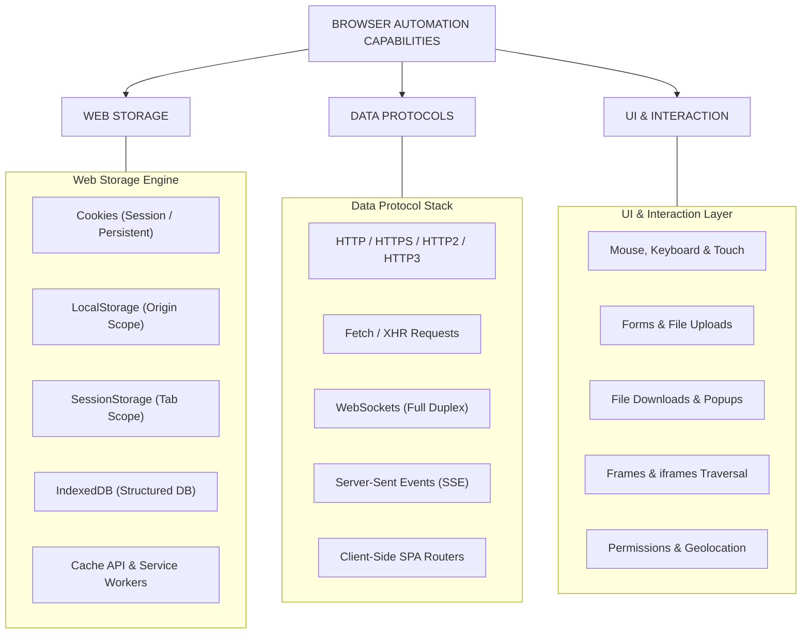
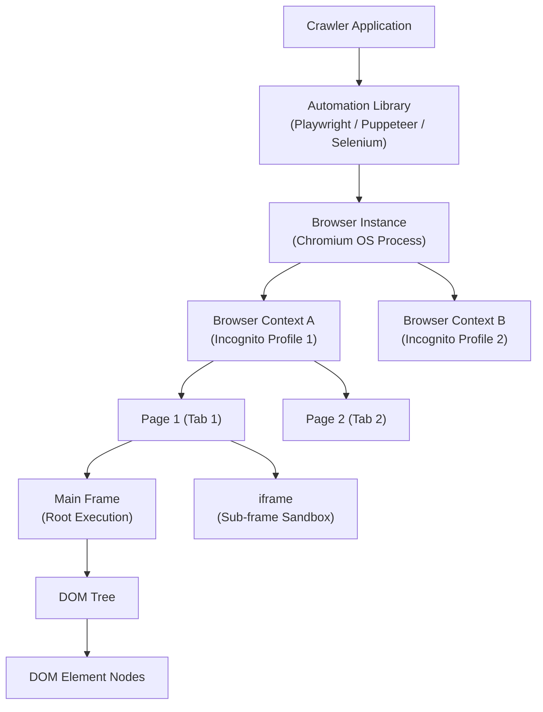
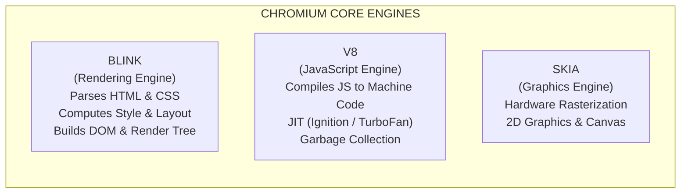
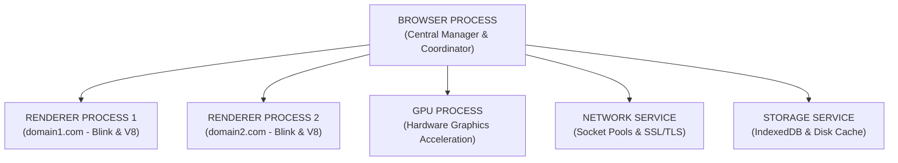
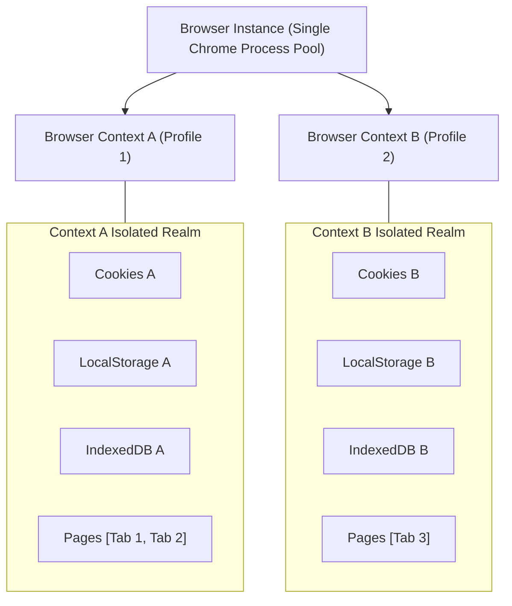
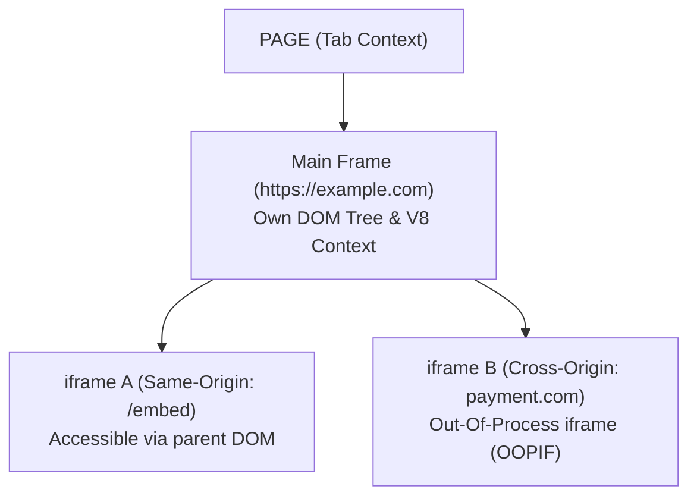
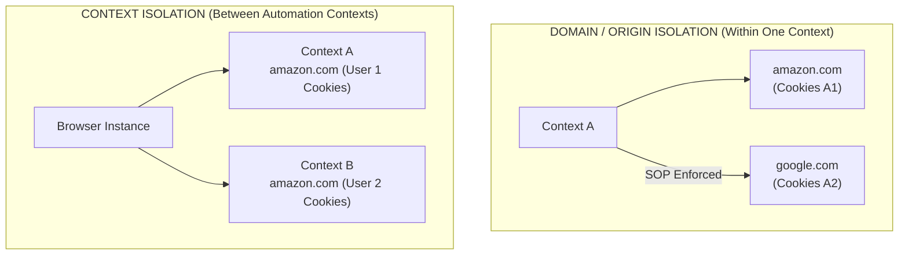

# 02 - Browser Architecture & Object Model Hierarchy

> **NOTE**: Google Docs Export Version (Formatted for pasting as document tabs).

## Overview
To build reliable, scalable browser automation systems, one must understand how modern web browsers are built internally. Headless browser automation is not just fetching HTML—it involves orchestrating a complex, multi-process software system. This module dissects Chromium process architecture, browser engines (Blink, V8, Skia), the object model hierarchy from Browser instance down to DOM Elements, and isolation boundaries.

---

## 3. The Scope of Browser Crawling

When automating a headless browser (Playwright, Puppeteer, Selenium), the crawler interacts with the full software stack of a modern web engine:

---

## 4. Browser Crawling Hierarchy

Modern browser automation abstractions map directly to a strict top-down hierarchy:

---

## 5. The Browser Instance

The **Browser** represents the top-level running instance of a browser binary (e.g., `chrome.exe`, `chromium-headless`).

### Browser-Level Responsibilities
* **Process Lifetime Management**: Managing native OS process lifetimes and thread pools.
* **Resource Allocation**: Allocating system resources (RAM limits, GPU acceleration memory, socket pools).
* **Child Process Orchestration**: Hosting the core **Browser Process** and spawning child processes (Renderer, GPU, Network Service).
* **Profile Hosting**: Hosting multiple independent **Browser Contexts** (incognito profiles).

### Major Browser Engines & Implementations

| Browser | Core Rendering Engine | JavaScript Engine | Primary Automation Framework |
| :--- | :--- | :--- | :--- |
| **Chromium / Chrome** | Blink | V8 | Playwright, Puppeteer, Selenium |
| **Firefox** | Gecko | SpiderMonkey | Playwright, Selenium |
| **WebKit / Safari** | WebKit | JavaScriptCore (JSC) | Playwright, Selenium |
| **Microsoft Edge** | Blink | V8 | Playwright, Puppeteer, Selenium |

---

## 6. Chromium Architecture & Internal Engines

Chromium is the foundational open-source browser project that powers Google Chrome, Microsoft Edge, Brave, and Opera. It relies on three primary specialized engines:

### Core Sub-systems
* **Blink**: Fork of WebCore (WebKit). Responsible for parsing HTML/CSS, building the DOM and Layout trees, computing styles, and triggering paints.
* **V8 Engine**: High-performance JavaScript and WebAssembly engine written in C++. Performs Just-In-Time (JIT) compilation, memory allocation, and garbage collection.
* **Skia Graphics Library**: 2D graphics library used to render text, geometries, and images across CPU/GPU backends.
* **IPC Protocol (Inter-Process Communication)**: Mojo IPC framework used by Chromium to send asynchronous messages between the central Browser process and isolated child processes.

---

## 7. Multi-Process Architecture

Chromium uses a multi-process architecture to isolate failures, prevent security breaches, and utilize multi-core CPUs.

### 7.1 Process Responsibilities
1. **Browser Process**:
   * Controls the "chrome" of the application (address bar, tab management, back/forward buttons).
   * Coordinates security permissions, navigation requests, and process creation.
   * Manages child process lifecycles and OS IPC channels.

2. **Renderer Process**:
   * Runs inside an OS-level sandbox restriction.
   * Executes Blink (HTML/CSS parsing) and V8 (JavaScript execution).
   * By default, Chromium spawns a separate Renderer Process for each site/domain (Site Isolation).

3. **GPU Process**:
   * Handles graphics drawing requests from multiple tabs and composites them onto the screen using OS graphics APIs (DirectX, OpenGL, Vulkan, Metal).

4. **Network Service Process**:
   * Handles network requests, socket pools, HTTP/1.1, HTTP/2, HTTP/3 protocol stacks, SSL/TLS handshakes, and network caching.

5. **Storage & Utility Processes**:
   * Isolated helpers for disk I/O, IndexedDB operations, audio decoding, and device API access.

---

## 8. Browser Context (Isolated Profiles)

A **Browser Context** represents an isolated, in-memory browser profile inside a single running Browser process (equivalent to an Incognito window).

> **IMPORTANT**: **Key Optimization Rule**: `New Browser Context ≠ New Chromium Process`.
> Creating a new Browser Context takes **milliseconds** and negligible RAM because it reuses the main running Chromium Browser process, GPU process, and Network Service while creating isolated state stores.

---

## 9. Page (Tabs & Documents)

A **Page** corresponds to a single tab or window within a Browser Context.

### Characteristics
* Belongs to exactly one Browser Context.
* Pages inside the **same context share storage** (Cookies, LocalStorage, IndexedDB) if navigating to the same origin.
* Houses the **Main Frame** and child sub-frames.
* Listens to page lifecycle events (`domcontentloaded`, `load`, `networkidle`).

---

## 10. Frame & iframe Mechanics

A **Frame** represents a distinct document execution context. A Page always contains one **Main Frame**, and may contain multiple nested sub-frames (`<iframe>`).

### Same-Origin vs. Cross-Origin Frames
* **Same-Origin `<iframe>`**: Shares execution context limits; parent scripts can directly access `iframe.contentDocument`.
* **Cross-Origin `<iframe>` (OOPIF)**: Rendered in a completely separate OS Renderer Process for security. Parent scripts cannot read cross-origin iframe DOM without postMessage permissions.

---

## 42. Browser Hierarchy Component Matrix

| Level / Component | Main Scope & Purpose | Shared Dependencies |
| :--- | :--- | :--- |
| **Browser** | Binary process pool host. | Shared OS binary, GPU process, network socket infrastructure. |
| **Browser Context** | Isolated session profile / cookie container. | Shared binary host; isolated cookies, storage, cache, permissions. |
| **Page** | Single visual tab / document host. | Shares context-level storage and session state with sibling pages. |
| **Frame** | Document execution context (Main or iframe).| Has its own document, window, DOM tree, and JS execution context. |
| **DOM** | Hierarchical node tree representation of HTML. | Bound to a specific Frame document. |
| **Element** | Individual DOM Node (`
`, `<input>`, `<a>`).| Bound to DOM tree; target for automation actions (clicks, types). |

---

## 43. Browser Context Isolation vs. Domain Isolation

It is critical to distinguish between **Domain (Origin) Isolation** enforced by the browser's security model and **Context Isolation** controlled by automation engines:

