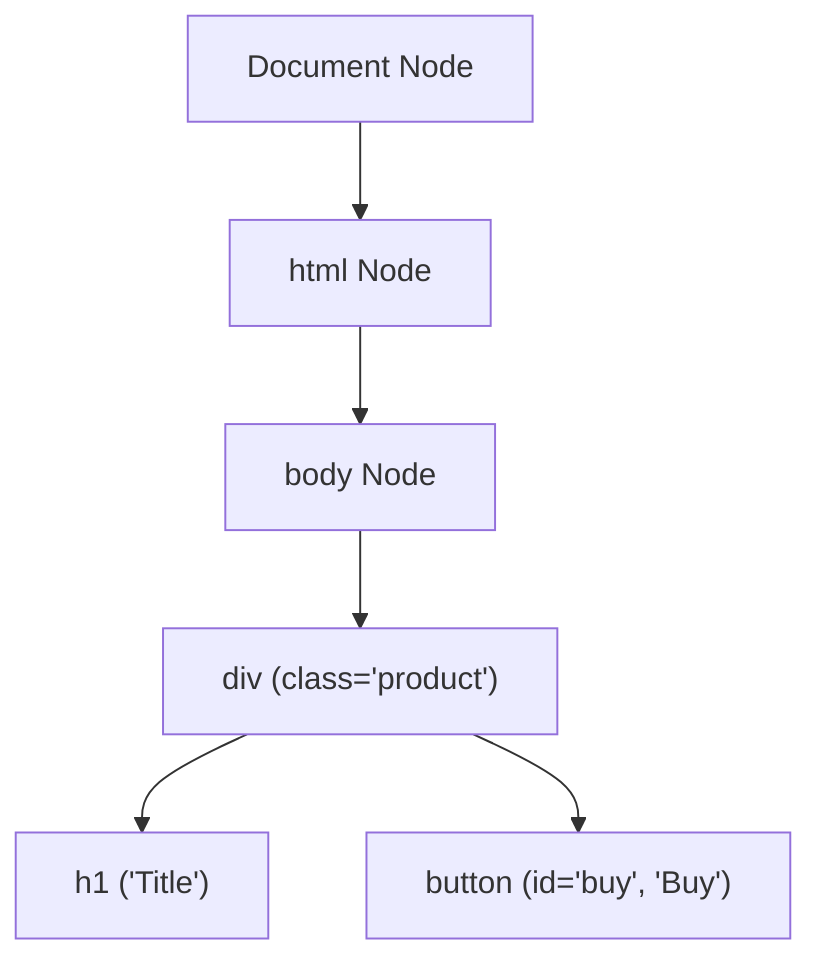
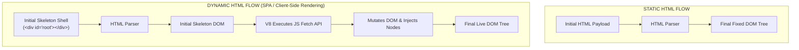
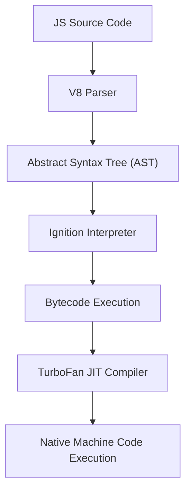
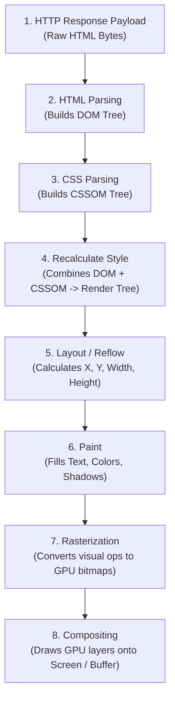
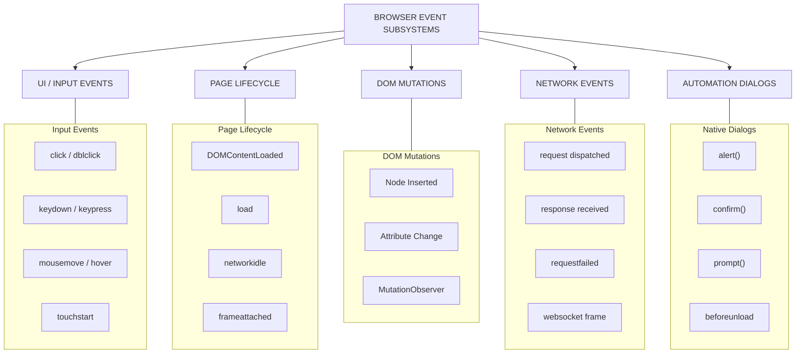

# 03 - Document Processing, Rendering Pipeline & Client Execution

> **NOTE**: Google Docs Export Version (Formatted for pasting as document tabs).

## Overview
Web documents undergo complex multi-phase transformations inside a headless browser engine before structured data becomes visible or extractable. This module examines HTML parsing, DOM construction, CSS processing, V8 JavaScript runtime execution, the complete 8-stage browser rendering pipeline, event loop mechanics, and navigation patterns.

---

## 11. The Document Object Model (DOM)

The **DOM** is an in-memory object graph created by the browser engine (Blink) representing an HTML or XML document.

### Targeting DOM Nodes in Automation
* **CSS Selectors**: Fast engine selection matching syntax (`div.product > button#buy`).
* **XPath Expressions**: Flexible directional tree navigation including parent traversal (`//div[@class='product']/button[text()='Buy']/..`).
* **ARIA / Role Selectors**: Modern accessibility targeting (`page.getByRole('button', { name: 'Buy' })`).
* **Text & Regex Selectors**: Finding elements based on visible text substrings or patterns (`page.getByText(/buy now/i)`).

---

## 12. HTML Processing & Dynamic HTML

Web browser HTML parsers follow the **HTML5 Spec Error Recovery Algorithm**, making them highly forgiving of invalid markup, missing closing tags, or unescaped characters.

### Key HTML Processing Actions
* **Tokenization**: Converting HTML streams into StartTag, EndTag, Character, and Comment tokens.
* **Tree Construction**: Consuming tokens to construct `Element` and `Text` DOM nodes.
* **Script Blocking Behavior**: Synchronous `<script>` tags halt HTML parsing until downloaded and executed (unless marked `async` or `defer`).

---

## 13. CSS Processing & Layout Computation

CSS parsing directly influences node visibility and element positioning, which automation tools evaluate before interacting with DOM nodes:

* **Computed Style Calculations**: Merging external stylesheets (`<link rel="stylesheet">`), internal `<style>` tags, inline `style="..."` attributes, and browser default user-agent styles into final computed rules for every node.
* **Element Visibility & Clickability Rules**:
  * `display: none`: Node is excluded from the Layout Tree (cannot be clicked or focused).
  * `visibility: hidden` / `opacity: 0`: Node exists in Layout Tree and occupies visual space, but is invisible to visual inspection.
  * `z-index` & Overlapping Elements: Overlay elements (cookie consent modals, sticky headers) block pointer events to underlying target buttons.

---

## 14. JavaScript Engine Runtime (V8 Internals)

JavaScript execution in Chromium is handled by the **V8 Engine**.

### Async Execution Architecture
* **Event Loop**: Monitors the Call Stack and moves tasks from Task Queues (Macrotasks) and Microtask Queues (Promises) into execution context.
* **Microtasks vs. Macrotasks**: Promise callbacks (`.then()`, `await`) run as high-priority Microtasks before the browser yields to rendering. Timers (`setTimeout`) run as Macrotasks.
* **Network Operations**: Asynchronous Fetch/XHR network requests delegate socket operations to the Chromium Network Service without blocking the V8 main thread.

---

## 15. Browser Web APIs Exposed to JavaScript

JavaScript inside V8 interacts with the browser shell via standardized Web APIs:

| Category | API Interfaces | Purpose & Capabilities |
| :--- | :--- | :--- |
| **DOM & Document** | `document.querySelector()`, `MutationObserver` | Dynamic element querying, node creation, DOM mutation tracking. |
| **Networking** | `window.fetch()`, `XMLHttpRequest`, `WebSocket` | Background HTTP JSON fetching, full-duplex socket streaming. |
| **Storage & State** | `localStorage`, `sessionStorage`, `indexedDB` | Origin key-value storage, client-side transactional database. |
| **Workers & Hardware** | `ServiceWorker`, `WebWorker`, `Canvas`, `WebGL` | Background network proxying, multi-threaded CPU calculation, 2D/3D graphics. |

---

## 44. The Complete Browser Rendering Pipeline

When a page loads or JavaScript mutates DOM/CSS, Chromium executes an 8-stage pipeline:

> **WARNING**: **Reflow Performance Triggers**: In automated browser interaction, querying properties like `element.getBoundingClientRect()` or `element.offsetWidth` forces V8 to synchronously trigger **Stage 5 (Layout)**, causing performance degradation if invoked inside loops.

---

## 45. The Browser Event System

Browser crawlers trigger, intercept, and await events across multiple execution subsystems:

### Critical Lifecycle Events for Automation
* **`DOMContentLoaded`**: Fired when HTML document parsing is complete and the DOM tree is built (external CSS/Images may still be downloading).
* **`load`**: Fired when HTML, CSS, external scripts, fonts, and images have completely finished downloading.
* **`networkidle`**: Automation concept (Playwright/Puppeteer) triggered when network requests drop to zero (or $\le 2$) for a sustained duration (e.g., 500ms).

---

## 46. Web Navigation Mechanics & SPA Routing

Crawler navigation falls into three distinct technical categories:

```mermaid
flowchart TD
    subgraph HardNav["1. HARD SERVER NAVIGATION"]
        H1["Browser"] -- "New HTTP Request" --> H2["Web Server"] -- "Full HTML Response" --> H3["Full Page Refresh"]
    end

    subgraph SPANav["2. CLIENT-SIDE SPA NAVIGATION"]
        S1["User Click / Route"] --> S2["JS Intercepts"] --> S3["window.history.pushState()"] --> S4["Fetch API JSON"] --> S5["DOM Mutated in Place"]
    end

    subgraph HashNav["3. FRAGMENT / HASH NAVIGATION"]
        Z1["Navigation to #section"] --> Z2["Triggers window.onhashchange"] --> Z3["Smooth Viewport Scroll"]
    end
```

### Navigation Variants
* **HTTP Redirects**: Server-sent `301 Moved Permanently` or `302 Found` response headers.
* **Client-Side Meta Refresh**: `<meta http-equiv="refresh" content="5;url=...">` tags.
* **JS Window Navigation**: Scripts calling `window.location.href = "..."` or `window.location.replace("...")`.
* **Popups & New Tab Targets**: Links specifying `target="_blank"`, triggering `window.open()`.
