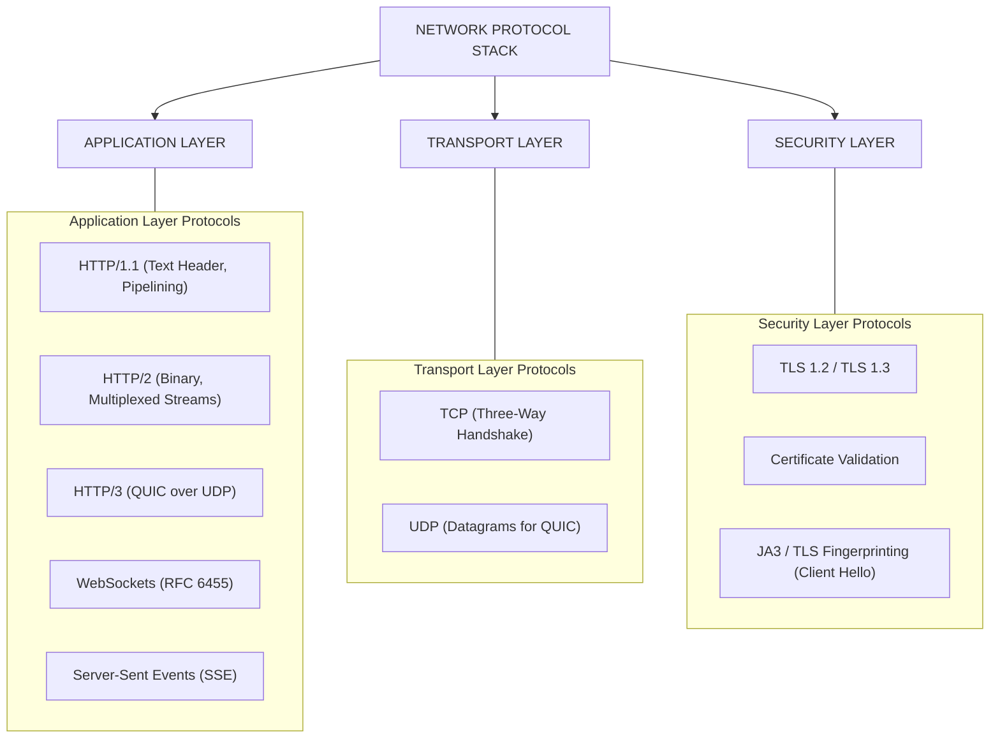
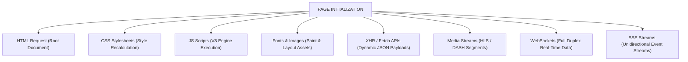
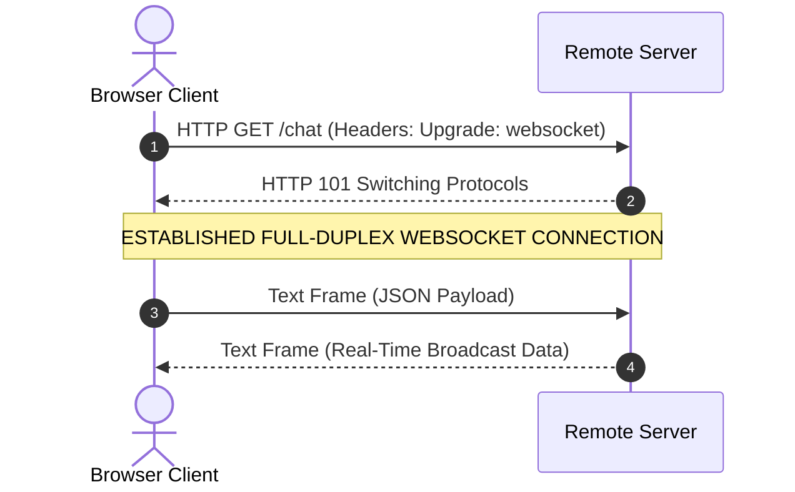
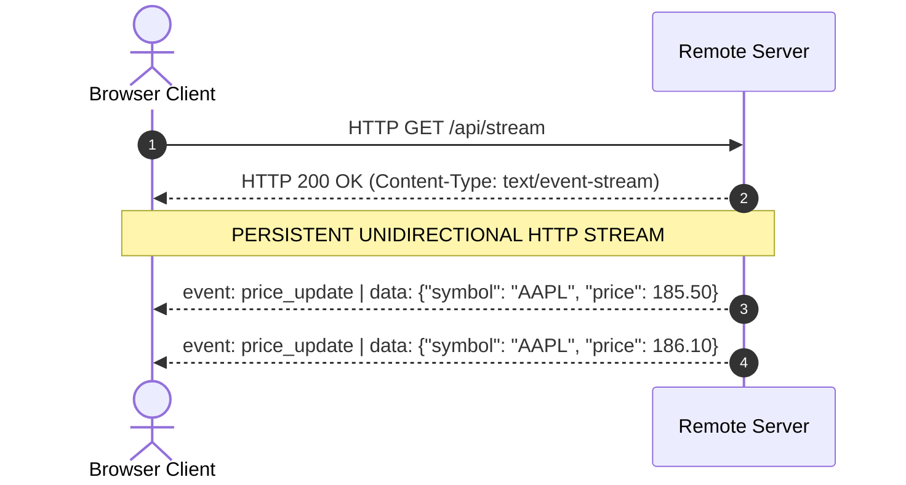
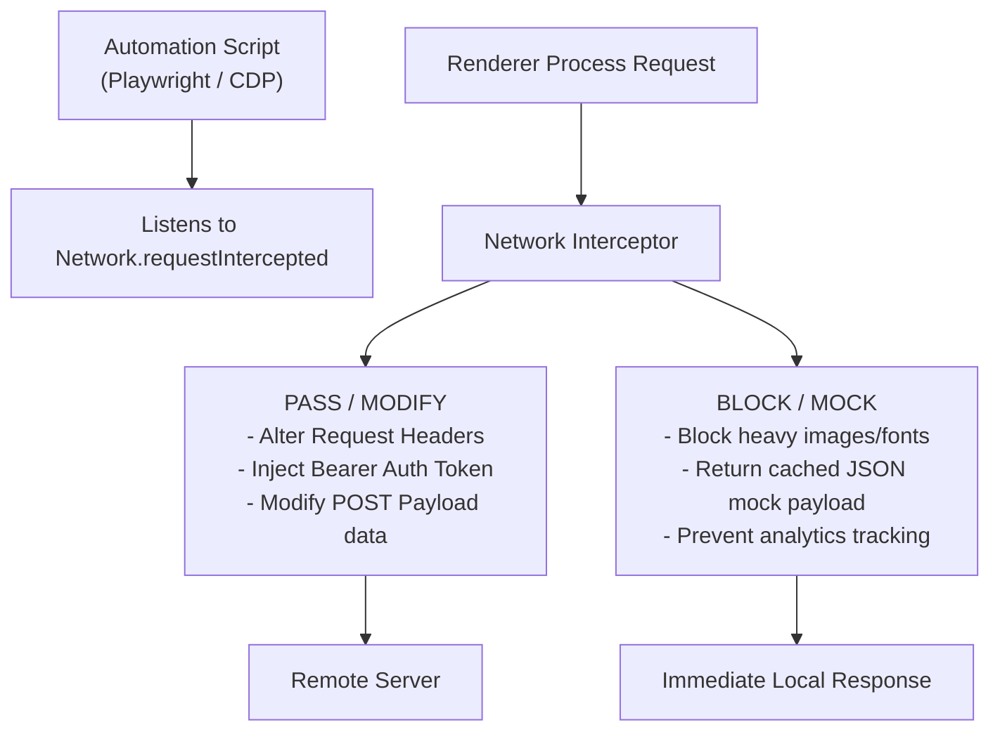

# 04 - Networking, Protocols & Interception Layer

> **NOTE**: Google Docs Export Version (Formatted for pasting as document tabs).

## Overview
Web crawlers depend heavily on understanding browser networking infrastructure. Modern web applications do not just fetch flat HTML; they initiate complex transport connections over HTTP/1.1, HTTP/2, and HTTP/3 QUIC, negotiate TLS handshakes, stream persistent data via WebSockets and Server-Sent Events, and load dozens of subresources. Headless browsers provide powerful APIs to intercept, modify, block, and log these network exchanges.

---

## 16. The Network Layer Infrastructure

Browser network communication relies on a layered protocol stack managed by Chromium's Network Service process:

### HTTP Protocol Evolution Matrix

| Protocol Version | Underlying Transport | Multiplexing Model | Header Compression | Head-of-Line Blocking |
| :--- | :--- | :--- | :--- | :--- |
| **HTTP/1.1** | TCP | Sequential (Keep-Alive) | ❌ Plaintext headers | ⚠️ Yes (At HTTP level) |
| **HTTP/2** | TCP | Binary Stream Multiplexing | ✅ HPACK | ⚠️ Yes (At TCP packet level) |
| **HTTP/3** | UDP (QUIC) | Independent QUIC Streams | ✅ QPACK | ✅ Eliminated completely |

---

## 17. The Browser Network Request Spectrum

When a single page load occurs, Chromium generates a spectrum of subresource network requests:

---

## 25. WebSockets (Full-Duplex Real-Time Data)

WebSockets provide persistent, bidirectional, low-latency TCP communication between client and server (`ws://` or `wss://`).

### Relevance for Crawlers
* Financial portals, crypto exchanges, betting platforms, and live chats broadcast data strictly over WebSockets.
* Automation engines (Playwright/Puppeteer) intercept WebSocket frame events (`page.on('websocket')`) to record real-time data frames directly without parsing HTML.

---

## 26. Server-Sent Events (SSE / EventSource)

Server-Sent Events (SSE) provide a lightweight, unidirectional stream from server to client over standard HTTP (`text/event-stream`).

---

## 47. Subresource Loading Lifecycle

Browser engines prioritize subresource loads based on resource type and viewport position:

| Priority Level | Resource Types | Loading Behavior |
| :--- | :--- | :--- |
| **Priority 1 (Highest)** | Main HTML Document, Synchronous `<script>`, CSS Stylesheets | Blocks rendering until downloaded and parsed. |
| **Priority 2 (High)** | Visible Viewport Images, Fonts, Active XHR/Fetch requests | Scheduled immediately for painting and data injection. |
| **Priority 3 (Medium)** | Async / Defer JavaScript files | Downloaded in background without blocking DOM parsing. |
| **Priority 4 (Low)** | Offscreen Below-the-Fold Images, Analytics scripts | Delayed until main network idle or scroll trigger. |

---

## 49. Network Interception & Request Routing

Network Interception allows automation tools to sit directly inside Chromium's network layer to observe, modify, block, or mock network requests.

### Strategic Use Cases for Scrapers
1. **Performance & Speed Optimization**: Blocking media assets (`.png`, `.jpg`, `.mp4`, `.woff2`) reduces bandwidth by 80% and increases page crawl speed by 3x–5x.
2. **API Data Extraction**: Capturing background XHR/Fetch JSON responses directly (`response.json()`) eliminates the need to scrape HTML altogether.
3. **Authentication Injection**: Automatically appending custom authorization headers (`Authorization: Bearer <token>`) or custom cookies to outgoing requests.
4. **Bypassing Bot Blockers**: Filtering or modifying headers (`User-Agent`, `Sec-Ch-Ua`) to ensure browser request signatures match expected profiles.
