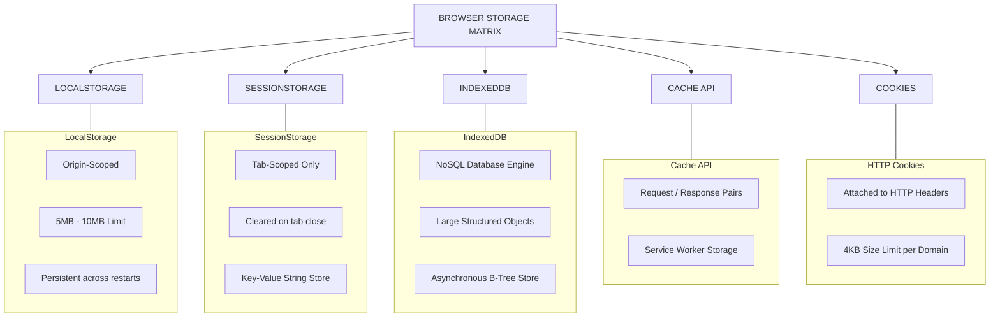
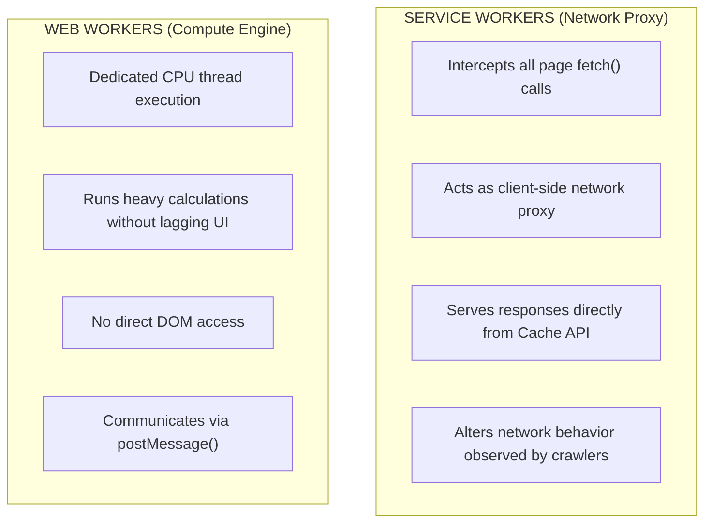
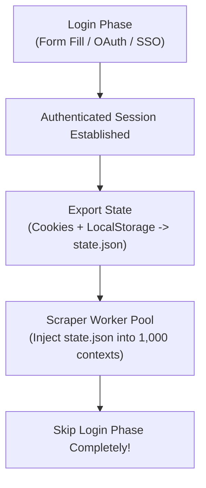
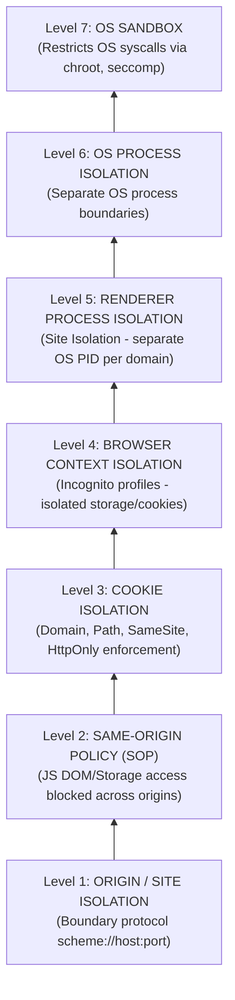

# 05 - Storage Engines, Browser State & Security Isolation

> **NOTE**: Google Docs Export Version (Formatted for pasting as document tabs).

## Overview
Managing browser state, cookies, storage mechanisms, client authentication, and security boundaries is critical for crawling authenticated web applications and scaling scraper infrastructure safely. This module covers all browser storage engines, background workers, authentication strategies, the 7-level browser isolation model, and web security specifications.

---

## 18. Cookie Storage Engine & Flag Mechanics

Cookies are key-value pairs attached to HTTP headers (`Cookie:` request header and `Set-Cookie:` response header) managed strictly by Chromium's Network Service.

```http
Set-Cookie: session_id=xyz123; Domain=.example.com; Path=/; Secure; HttpOnly; SameSite=Lax; Max-Age=86400
```

### Cookie Attribute Breakdown & Security Enforcement

| Flag / Attribute | Functional Behavior & Scraper Impact |
| :--- | :--- |
| **Domain** | Specifies which host domains can receive the cookie (e.g., `.example.com` includes all subdomains). |
| **Path** | Restricts cookie transmission to specific URL paths (e.g., `/app`). |
| **Expires / Max-Age** | Session cookie (deleted when context closes) vs. Persistent cookie (persisted until timestamp). |
| **Secure** | Restricts cookie transmission strictly to encrypted `https://` connections. |
| **HttpOnly** | Blocks JavaScript (`document.cookie`) access. Prevents XSS theft, but scrapers cannot read it via evaluate. |
| **SameSite=Strict** | Cookie is never sent in cross-site requests (e.g., following an external link). |
| **SameSite=Lax** | Default setting. Sent on top-level navigation GET requests, but blocked on cross-site POSTs. |
| **SameSite=None** | Cookie sent on all cross-site requests (requires `Secure` flag). |

---

## 19–22. Client-Side Browser Storage Engines

Web applications use four distinct client-side storage technologies:



### Storage Systems Details
* **LocalStorage (`window.localStorage`)**: Synchronous string key-value storage persisted across browser restarts per origin (`https://example.com:443`).
* **SessionStorage (`window.sessionStorage`)**: Isolated strictly to a single page tab. Opening a new tab creates a fresh `sessionStorage` instance.
* **IndexedDB**: Asynchronous transactional NoSQL database storing structured JS objects, blobs, and indexes inside LevelDB files on disk.
* **Cache API (`window.caches`)**: Request/Response storage engine used by Service Workers to cache offline static bundles and API responses.

---

## 23–24. Background Workers (Service Workers & Web Workers)

Chromium executes background scripts outside the main window thread:



> **WARNING**: **Service Worker Scraper Trap**: Service Workers can intercept network calls and return cached data without hitting remote web servers. Scrapers using network logging must inspect whether responses originated from `From Service Worker`.

---

## 27–28. Comprehensive Browser State & Authentication Flows

Authenticating scrapers requires capturing, saving, and re-injecting full browser states.



### Supported Authentication Scenarios
* **Form-Based Auth**: Typing credentials into inputs and handling CSRF tokens.
* **Token-Based / OAuth 2.0 / JWT**: Storing Bearer tokens in LocalStorage or memory.
* **Single Sign-On (SSO) & SAML**: Traversing external identity provider redirects (`login.microsoftonline.com`).
* **HTTP Basic / Digest Auth**: Handled at network layer (`page.authenticate({ username, password })`).

---

## 29. The 7-Level Browser Isolation Pyramid

Chromium enforces security and isolation across 7 distinct operational levels:



---

## 30. Web Security Specifications Matrix

| Security Specification | Mechanism & Enforcement | Impact on Web Automation / Crawling |
| :--- | :--- | :--- |
| **Same-Origin Policy (SOP)**| Blocks scripts on Origin A from reading DOM/Storage on Origin B. | Prevents cross-origin frame inspection without explicit CDP override. |
| **Cross-Origin Resource Sharing (CORS)**| Server headers (`Access-Control-Allow-Origin`) control cross-domain fetch. | Headless browsers enforce CORS strictly when scripts make fetch requests. |
| **Content Security Policy (CSP)**| Server header (`Content-Security-Policy`) restricts inline JS execution & fetch domains. | Can block scraper script injection (`page.evaluate()`) if strict inline policies apply. |
| **TLS Certificate Validation**| Validates HTTPS certificate chains and revocation lists. | Self-signed or intercepting proxy certificates fail unless `ignoreHTTPSErrors: true`. |
| **Mixed Content Protection**| Blocks unencrypted `http://` subresources on `https://` pages. | Browser engine drops unencrypted images/scripts automatically. |
