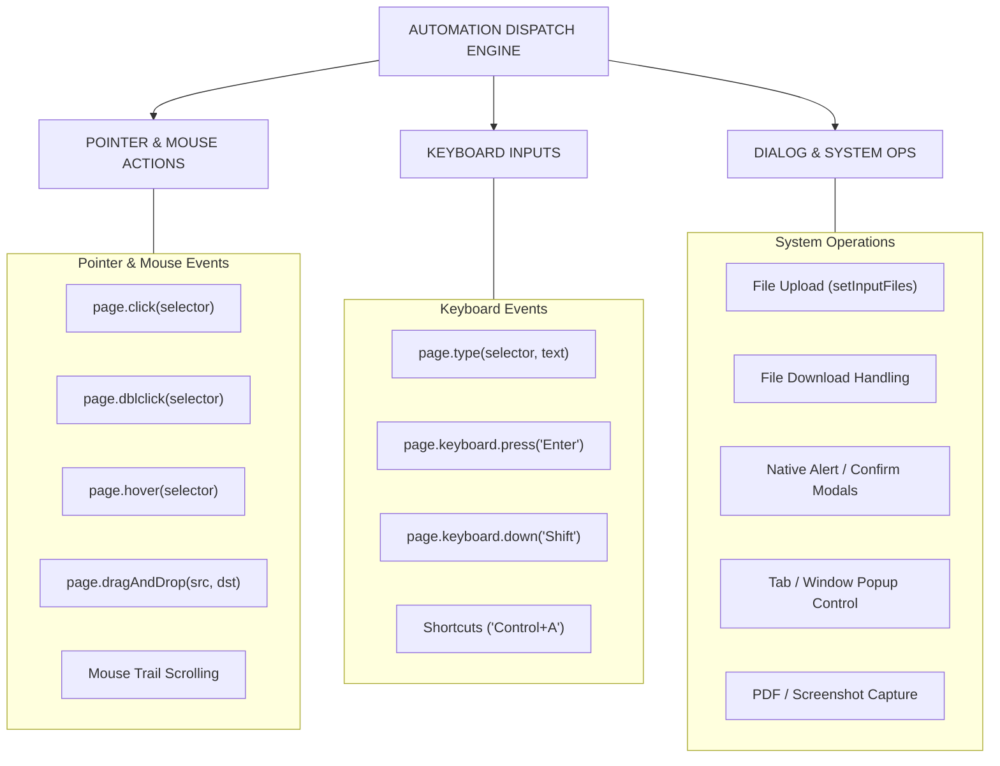
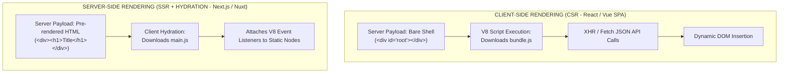

# 06 - Dynamic Web Applications & UI Interaction Automation

> **NOTE**: Google Docs Export Version (Formatted for pasting as document tabs).

## Overview
Modern web applications rely heavily on client-side JavaScript frameworks, client-side rendering (CSR), server-side rendering (SSR) with hydration, and dynamic DOM updates. To extract data effectively from these interactive interfaces, web crawlers must simulate human user input events, manage dynamic component lifecycles, and trigger hidden DOM state changes.

---

## 31. Synthetic User Interactions & Automation Actions

Browser automation tools (Playwright, Puppeteer, Selenium) provide high-level APIs that dispatch low-level synthetic input events directly to Chromium's Renderer Process:

### Comprehensive Interaction Breakdown
* **Pointer Events**:
  * **Click / Double Click**: Triggers `pointerdown`, `mousedown`, `pointerup`, `mouseup`, and `click` event sequences.
  * **Hovering**: Fires `pointerover`, `mouseover`, `pointermove`, and `mousemove` events necessary to reveal flyout menus and dropdowns.
  * **Drag and Drop**: Simulates complex drag sequences (e.g., slider CAPTCHAs, kanban board rearranging).
  * **Scrolling**: Dispatches mouse wheel events and mutates `window.scrollY` / `element.scrollTop` to trigger dynamic viewport listeners (`IntersectionObserver`).

* **Keyboard Input & Form Controls**:
  * **Element Typing**: Simulates real human typing with configurable delay between keystrokes to trigger keydown listeners and auto-complete dropdowns.
  * **Form Submissions**: Submitting forms via submit button clicks or `Enter` keypresses, handling form validation attributes (`required`, `pattern`).
  * **File Uploads & Downloads**: Intercepting browser native file picker dialogs to supply local file paths, and catching download events (`page.on('download')`) to save files to disk.

* **Modal, Dialog & Popup Orchestration**:
  * **JS Alerts & Confirmations**: Auto-accepting or dismissing `window.alert()`, `window.confirm()`, and `window.prompt()` modals using page event listeners.
  * **Popups & New Tabs**: Catching `target="_blank"` windows or script-triggered `window.open()` calls to gain control of newly spawned target pages.

---

## 32. Dynamic Web Frameworks, SSR & Client Hydration

Modern front-end web development relies on JavaScript frameworks that alter how documents are built and populated with data:

### Framework Architecture & Scraper Handling Strategy

| Framework / Architecture | Primary Data Delivery Model | Optimal Scraping Approach |
| :--- | :--- | :--- |
| **React / Vue SPA** | Empty shell + Client JSON API calls via Fetch/XHR. | Intercept XHR network responses directly or use headless browser. |
| **Next.js / Nuxt (SSR)** | Pre-rendered HTML + `__NEXT_DATA__` JSON tag in HTML. | Extract `<script id="__NEXT_DATA__">` JSON string directly without JS execution! |
| **Svelte / Angular** | Compiled DOM manipulation modules. | Wait for selector visibility (`page.waitForSelector()`) in headless browser. |
| **Infinite Scroll Feeds** | Dynamic XHR append upon scroll threshold. | Programmatically scroll page down in a loop until network idle. |
| **Lazy-Loaded Media** | `data-src` attribute replaced with `src` on scroll. | Force-scroll images into viewport or extract `data-src` / `srcset` attributes. |
