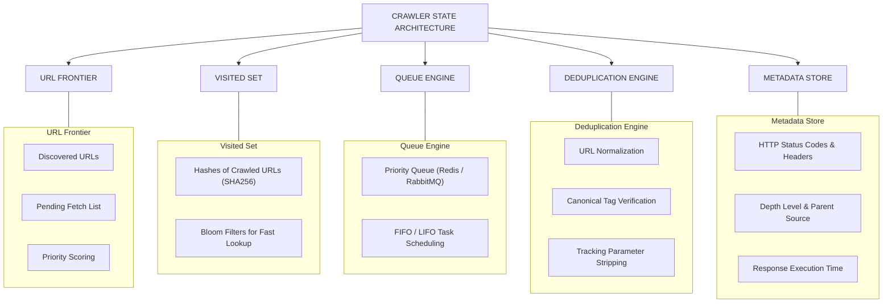
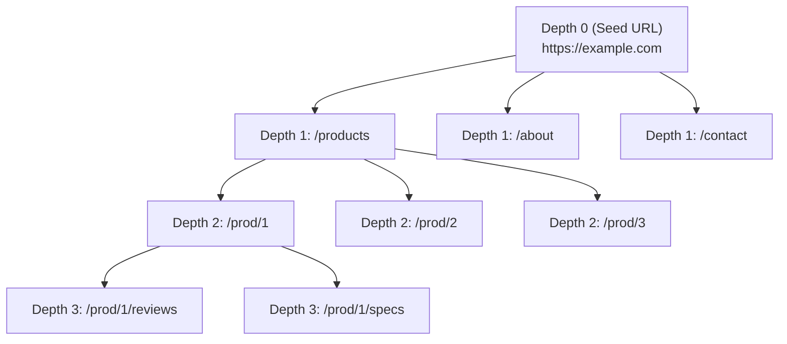
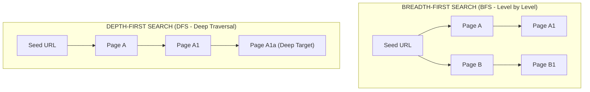

# 07 - Crawling Architecture, Strategies & State Control

> **NOTE**: Google Docs Export Version (Formatted for pasting as document tabs).

## Overview
Large-scale web crawling requires robust state management, URL deduplication, crawl tree traversal algorithms, and strict depth control. Without well-designed state engines and crawling strategies, a web crawler will fall into infinite loop traps, crawl duplicate pages, violate host rate limits, or consume excessive system storage.

---

## 33. Crawling State Architecture & Components

A production crawler relies on five fundamental state components:

### Detailed Sub-system Operations
* **URL Frontier**: The centralized repository holding all discovered URLs waiting to be scheduled for fetching.
* **Visited Set & Deduplication**:
  * **Bloom Filters**: High-performance probabilistic data structures used to test set membership in memory with minimal RAM footprint.
  * **URL Normalization**: Standardizing raw URLs before hashing (`HTTP://Example.COM:80/foo/` $\rightarrow$ `http://example.com/foo`).
  * **Canonicalization**: Inspecting HTML `<link rel="canonical" href="...">` tags to collapse multiple URL aliases into a single primary URL.
  * **Tracking Parameter Removal**: Stripping marketing queries (`?utm_source=...`, `?gclid=...`, `?ref=...`) to avoid crawling duplicate pages.
* **Crawl Metadata Tracking**: Recording audit trails for every request (Timestamp, Response Time, Content-Type, Depth Level, Parent Source URL, Error Stack).

---

## 34 & 36. Crawling Hierarchy & Depth Traversal

Web crawlers view the internet as a directed graph where web pages are nodes and hyperlinks are edges.

---

## 35. Crawl Traversal Strategies

Depending on the business requirements, crawlers deploy different graph traversal strategies:

### Strategy Matrix

| Strategy | Algorithmic Traversal | Primary Operational Benefit |
| :--- | :--- | :--- |
| **Breadth-First Search (BFS)**| Level-by-level queue (FIFO). | Discovers high-level category pages fast; avoids getting stuck in deep URL traps. |
| **Depth-First Search (DFS)**| Stack-based queue (LIFO). | Useful when searching for specific deep nested documents or completing single items fast. |
| **Priority Crawling** | Weighted Priority Queue. | Ranks URLs by importance (e.g., domain authority, update frequency, page rank). |
| **Depth-Limited Crawling**| Max Depth Guard Condition. | Prevents crawlers from going deeper than $N$ levels from the seed URL. |
| **Domain-Restricted** | Domain Regex Whitelist. | Enforces strict host bounds (`allowed_domains = ['example.com']`). |
| **Sitemap Crawling** | Parses `sitemap.xml`. | Direct discovery of structured URLs without relying solely on HTML link parsing. |
| **API-Assisted / Hybrid**| XHR Discovery + HTML Crawl.| Combines backend API endpoint extraction with traditional HTML link following. |
