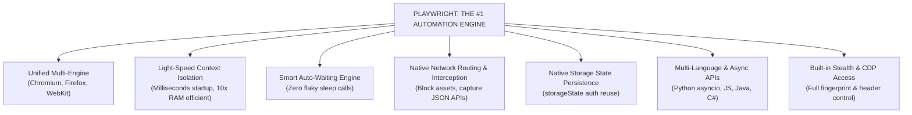
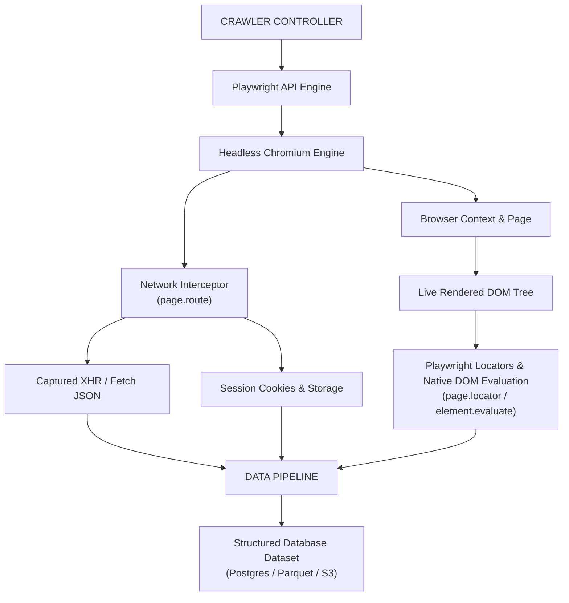
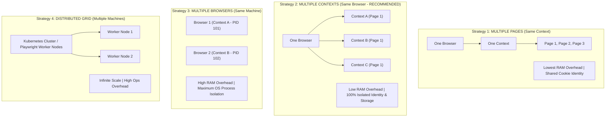
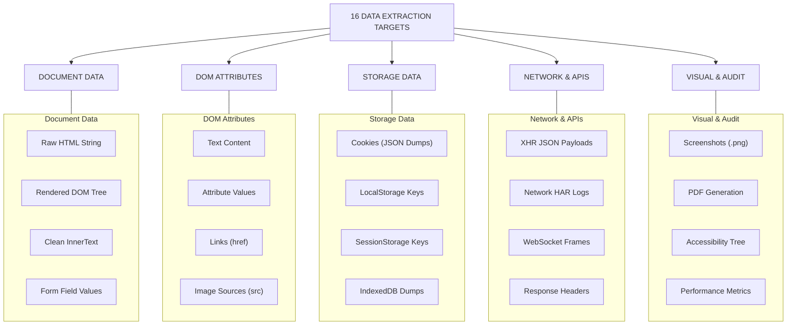

# 08 - Tools Ecosystem, Concurrency Models & End-to-End Systems

> **NOTE**: Google Docs Export Version (Formatted for pasting as document tabs).

## Overview
Building modern web data extraction systems requires selecting the right framework ecosystem, choosing optimal concurrency models, and assembling an end-to-end crawling pipeline. This module evaluates the primary browser automation and crawling frameworks (Playwright, Puppeteer, Selenium, Cypress, and Scrapy), provides an in-depth analysis of their pros and cons, explains why **Playwright** stands as the undisputed best tool for modern web automation, details concurrency scaling patterns, categorizes extraction targets, and presents the full 20-step end-to-end browser crawling system flowchart.

---

## 37. Complete Automation Framework Matrix & Pros/Cons Analysis

| Tool / Framework | Primary Architecture | Supported Browsers | Async Paradigm | Primary Use Case |
| :--- | :--- | :--- | :--- | :--- |
| **Playwright** | Direct IPC via CDP / Firefox / WebKit protocols | Chromium, Firefox, WebKit | Native `async/await` (Node, Python, Java, .NET) | Modern gold standard for dynamic web scraping, UI testing, and API interception. |
| **Puppeteer** | Direct Chrome DevTools Protocol (CDP) | Chromium, Chrome | JS Promises / `async/await` (Node.js) | Native Chrome automation maintained by Google; fast Node.js scraper setups. |
| **Selenium** | W3C WebDriver Protocol over HTTP REST | Chrome, Firefox, Edge, Safari | Language-dependent (Python, Java, C#, Ruby) | Legacy cross-browser automation; enterprise grid testing infrastructure. |
| **Cypress** | In-Browser Execution Proxy | Chromium, Firefox | Async Chained Commands (JS) | Front-end web application testing; restricted for general-purpose crawling. |
| **Scrapy** | Twisted Event-Driven Networking | None (Pure HTTP client) | Async Event Loop (Python) | High-throughput HTTP crawling; combined with Playwright for dynamic rendering. |

---

### Detailed Framework Breakdown: Pros & Cons

#### 1. Playwright
Created by Microsoft (built by the original team behind Puppeteer), Playwright was designed from the ground up for modern web automation.

* **Pros**:
  * **Multi-Browser Engine**: Native support for Chromium, Firefox, and WebKit (Safari engine) with a unified API.
  * **Browser Context Isolation**: Blazing-fast creation of incognito contexts in milliseconds, reusing the same browser binary.
  * **Built-in Auto-Waiting**: Eliminates flaky `sleep()` calls by automatically checking actionability before clicking or typing.
  * **First-Class Network Interception**: Easily intercept, block, modify, or mock requests and responses (`page.route()`).
  * **Native Auth State Storage**: Export and import session cookies and LocalStorage (`storageState()`) with one line of code.
  * **Multi-Language Support**: Available in Python (`asyncio` & sync), TypeScript/Node.js, Java, and .NET.
  * **Trace Viewer**: Time-travel visual debugging tool capturing network logs, DOM snapshots, and action overlays.
* **Cons**:
  * Slightly higher resource consumption than pure HTTP clients (requires browser binaries).
  * Younger ecosystem than legacy Selenium (though growing rapidly).

---

#### 2. Puppeteer
Maintained by Google's Chrome DevTools team, Puppeteer is a Node.js library controlling Chromium over CDP.

* **Pros**:
  * Native, low-level access to Chrome DevTools Protocol (CDP).
  * Lightweight footprint for Node.js environments.
  * Excellent for PDF generation and visual screenshot capture.
* **Cons**:
  * **Node.js Only**: Lacks native Python, Java, or C# bindings (requires community wrappers like `pyppeteer`).
  * **Chromium-Centric**: Firefox support is experimental; WebKit is unsupported.
  * Lacks built-in auto-waiting for complex dynamic UI elements compared to Playwright.

---

#### 3. Selenium WebDriver
The legacy industry standard for browser automation, operating via the W3C WebDriver HTTP REST protocol.

* **Pros**:
  * Huge legacy ecosystem and massive community support.
  * Broad browser coverage including native Safari on macOS/iOS.
  * Selenium Grid enables distributed execution across multiple physical machines.
* **Cons**:
  * **Slower Execution**: Operates over HTTP REST JSON Wire protocol, causing latency overhead per command.
  * **No Native Auto-Waiting**: Requires manual `WebDriverWait` and `ExpectedConditions` boilerplate to prevent flaky tests.
  * **Complex Session Isolation**: Creating new profiles requires spinning up entire heavy browser instances.
  * Weak native network interception capabilities compared to Playwright.

---

#### 4. Cypress
An in-browser end-to-end testing framework executed directly inside the browser window alongside application code.

* **Pros**:
  * Incredible developer experience and time-travel DOM inspection for front-end developers.
  * Native access to the page `window` object and JS app state.
* **Cons**:
  * **Unsuitable for Web Crawling**: Cannot navigate across multiple origins in a single test block easily.
  * Limited tab/popup control and iframe handling restrictions.
  * Heavy execution overhead designed strictly for local testing, not scalable web data extraction.

---

#### 5. Scrapy
An open-source, event-driven Python crawling framework powered by the Twisted networking engine.

* **Pros**:
  * **Unmatched HTTP Speed**: High concurrency and throughput using non-blocking asynchronous HTTP requests.
  * Built-in pipeline components for URL scheduling, middleware, proxy rotation, and data export (JSON/CSV/Parquet).
* **Cons**:
  * **No Built-in Rendering Engine**: Cannot execute JavaScript or parse dynamic SPAs out of the box (requires `scrapy-playwright` integration).

---

## 38. Why Playwright Reigns Supreme: The #1 Browser Automation Tool

Playwright is universally recognized by modern data engineers and automation architects as the **undisputed best tool for browser-based web scraping**. Here is why Playwright outperforms all alternative frameworks:



### Key Pillars of Playwright's Superiority

1. **Light-Speed Context Isolation**:
   While Selenium requires launching a new heavy OS browser process (~350MB RAM) for every isolated profile, Playwright creates a brand new **Browser Context** in milliseconds consuming less than ~15MB RAM. You can run hundreds of isolated incognito sessions concurrently inside a single Chromium instance!

2. **Smart Auto-Waiting Engine**:
   Playwright performs an internal suite of **actionability checks** before executing any action (Click, Type, Hover). It automatically waits for elements to be Attached to DOM, Visible, Stable (not animating), Enabled, and Unobscured. Flaky `time.sleep()` statements are completely eliminated.

3. **First-Class Network Interception**:
   Playwright allows intercepting any network request at the browser layer:
   ```python
   # Block images and stylesheets to boost crawl speed by 5x
   await page.route("**/*.{png,jpg,jpeg,svg,css}", lambda route: route.abort())
   
   # Capture backend API JSON responses directly
   async with page.expect_response("**/api/products") as response_info:
       await page.click("#load-products")
   data = await (await response_info.value).json()
   ```

4. **Storage State & Authentication Reuse**:
   With a single API call, Playwright exports full session cookies and LocalStorage into a lightweight JSON file. Worker threads can instantly inject this state to skip login flows across thousands of tasks:
   ```python
   # Save authenticated state
   await context.storage_state(path="auth.json")
   
   # Reuse in new context without logging in again!
   new_context = await browser.new_context(storage_state="auth.json")
   ```

5. **Powerful Locators & Web-First Assertions**:
   Playwright's `Locator` API is strict and auto-retrying. Locators match element state dynamically even when the DOM re-renders under React, Vue, or Angular updates.

---

## 39. Playwright-Powered Hybrid Scraping Architecture

In modern production scrapers, Playwright handles navigation, DOM rendering, network interception, and structured data extraction directly via native locator evaluation:



---

## 40 & 41. Browser Crawling Concurrency Models

Scaling browser crawlers requires choosing the correct level of process and context concurrency based on available CPU and RAM resources:



---

## 48. Browser-Level Data Extraction Spectrum

Headless browsers allow extracting data across 16 distinct operational targets:



---

## 54. Complete 20-Step End-to-End Playwright Crawl Workflow

The full execution flow of a production Playwright-driven browser crawler encompasses 20 distinct stages:

```mermaid
flowchart TD
    Step1["1. Seed URL Ingestion"] --> Step2["2. Crawl Scheduler (Queue in Priority Frontier)"]
    Step2 --> Step3["3. Playwright Framework Init (async with async_playwright())"]
    Step3 --> Step4["4. Chromium Process Spawn (Headless Binary Launch)"]
    Step4 --> Step5["5. Browser Context Allocation (Isolated Incognito Profile)"]
    Step5 --> Step6["6. Page Creation (Open Target Tab)"]
    Step6 --> Step7["7. Network Interception Setup (Attach page.route / Block Assets)"]
    Step7 --> Step8["8. Navigation Dispatch (page.goto(url))"]
    Step8 --> Step9["9. Network Transport (DNS / TLS / HTTP2 GET)"]
    Step9 --> Step10["10. Subresource Load (HTML, CSS, JS Bundles)"]
    Step10 --> Step11["11. V8 Script Execution (Client JS Exec & Initial DOM)"]
    Step11 --> Step12["12. State Initialization (Populate Cookies & storageState)"]
    Step12 --> Step13["13. Rendered DOM Generation (Blink Style, Layout & Paint)"]
    Step13 --> Step14["14. Synthetic User Interactions (Clicks, Scrolls, Form Typing)"]
    Step14 --> Step15["15. Dynamic DOM Mutation Wait (Await networkidle / Locators)"]
    Step15 --> Step16["16. Data Extraction Phase (Intercept XHR JSON & locator.evaluate)"]
    Step16 --> Step17["17. Schema Mapping & Cleaning (Native Playwright Locators)"]
    Step17 --> Step18["18. Structured Storage (Write to Postgres / Parquet / S3)"]
    Step18 --> Step19["19. Link Discovery & Deduplication (Extract URLs & Check Bloom Filter)"]
    Step19 --> Step20["20. Queue Enqueue & Context Teardown (Push URLs & Close Context)"]
```


