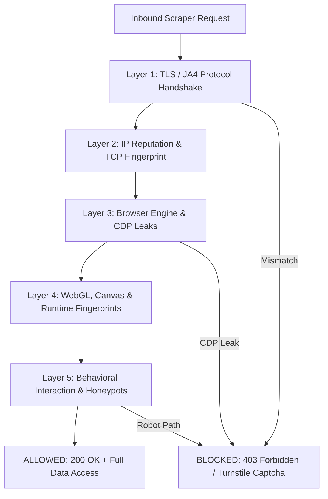
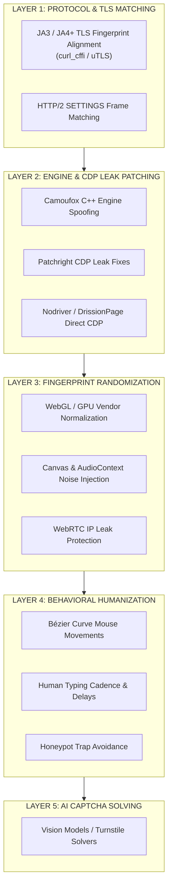
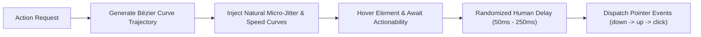
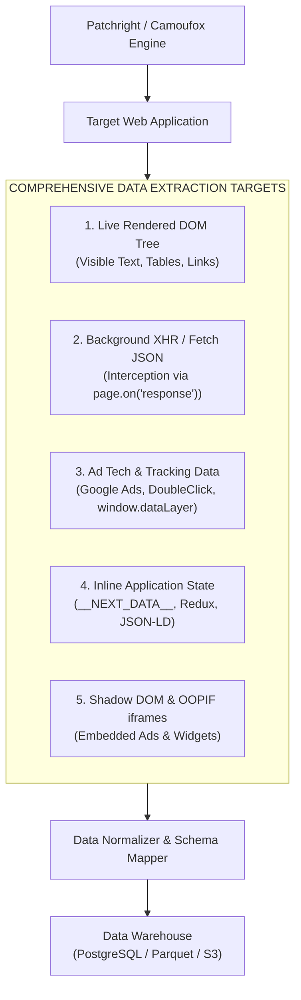

# 09 - Stealth Anti-Bot Evasion & Advanced Data Extraction Architecture

> **NOTE**: Google Docs Export Version (Formatted for pasting as document tabs).

## Overview
Modern anti-bot protection systems (Cloudflare Turnstile, DataDome, Akamai Bot Manager, Kasada, Imperva, PerimeterX) evaluate traffic across network protocols, browser engine signatures, and behavioral interactions. To extract **maximum data volume**—including dynamic content, ad networks, tracking tags, inline application states, hidden APIs, and media assets—without being blocked, scrapers must deploy a multi-layered stealth architecture that guarantees signal coherence across all execution layers.

---

## 1. The Multi-Layer Anti-Bot Detection Landscape

Anti-bot systems evaluate inbound traffic across 5 distinct operational layers:



> **WARNING**: **The Coherence Rule**: Modern anti-bot security systems flag requests primarily on **mismatches between layers**. Presenting a Chrome User-Agent header while using a Python OpenSSL TLS signature or a standard Playwright CDP connection causes an instant 403 block.

---

## 2. The 5-Layer Unbreakable Stealth Stack



---

### Layer 1: Protocol & Network Fingerprint Matching (JA3 / JA4+)

Modern security systems inspect the TCP/TLS handshake before a single byte of HTTP data is sent:

* **JA3 & JA4+ TLS Fingerprinting**: Anti-bot engines hash the TLS `Client Hello` packet (cipher suites, extensions, elliptic curves, ALPN). If the hash matches Python `requests` or `urllib` while the User-Agent claims to be Chrome 124, the request is dropped immediately.
* **HTTP/2 & HTTP/3 SETTINGS Alignment**: HTTP/2 multiplexing frames (`SETTINGS_HEADER_TABLE_SIZE`, `SETTINGS_INITIAL_WINDOW_SIZE`) differ between Chrome, Firefox, and Safari.
* **Mitigation**: Utilize low-level TLS impersonation libraries (`curl_cffi` or `uTLS`) or patched browser engines (`Camoufox`, `Patchright`) that negotiate handshakes natively matching the target browser binary.
* **Residential & Mobile Proxy Pools**: Route traffic through high-reputation residential or mobile 4G/5G IP pools with sticky session context management.

---

### Layer 2: Browser Engine-Level Patching (C++ vs. CDP)

Standard Playwright/Puppeteer automation leaks internal flags:

| Detection Flag | Vulnerability Mechanism | Patch / Mitigation Technique |
| :--- | :--- | :--- |
| **`navigator.webdriver`** | JS property set to `true` by automation binaries. | Overridden via `Patchright` or native browser C++ patches. |
| **CDP Leaks (`Runtime.enable`)** | CDP commands pollute window runtime context. | Patchright patches CDP event dispatching mechanisms. |
| **Console API Quirks** | Chrome automation modifies `console.debug` internals. | Patchright removes CDP console injection hooks. |
| **User-Agent & Sec-Ch-UA**| Headers mismatching underlying V8 binary build. | `Camoufox` modifies C++ source code to match native Firefox binary. |

* **Camoufox**: C++ engine-level spoofed Firefox fork. Modifies fingerprinted browser C++ source code (WebGL, canvas, WebRTC, audio) directly rather than injecting JavaScript scripts.
* **Patchright**: Drop-in Playwright replacement fixing CDP leaks and runtime overrides out of the box.
* **Nodriver**: Communicates directly via Chrome DevTools Protocol without standard WebDriver drivers.

---

### Layer 3: Runtime Fingerprint Randomization

Anti-bot systems execute client-side JavaScript fingerprinting scripts (FingerprintJS, Castle, DataDome) to evaluate hardware attributes:

1. **WebGL & GPU Spoofing**: Overriding `UNMASKED_VENDOR_WEBGL` and `UNMASKED_RENDERER_WEBGL` to return real consumer graphics cards (e.g., `ANGLE (NVIDIA, NVIDIA GeForce RTX 3080 Direct3D11 vs_5_0 ps_5_0)`).
2. **Canvas Noise Injection**: Injecting micro-scale noise into 2D canvas `toDataURL()` methods so every context yields a realistic, unique, non-automated canvas hash.
3. **AudioContext Fingerprinting**: Manipulating `OscillatorNode` and `DynamicsCompressorNode` frequency outputs to match real audio hardware buffers.
4. **WebRTC IP Protection**: Disabling WebRTC or routing STUN requests through the active proxy interface to prevent real IP leaks.

---

### Layer 4: Behavioral Humanization & Anti-Honeypot Engine

Anti-bot machine learning models track mouse trajectories, click delays, and scroll dynamics:



* **Bézier Curve Mouse Movements**: Instead of moving the mouse pointer in a straight line (instant robot detection), mouse movements follow non-deterministic cubic Bézier curves with natural acceleration, deceleration, and overshoot.
* **Typing Cadence**: Keystroke timing varies dynamically (30ms–150ms per key) with occasional backspacing simulation.
* **Honeypot Trap Avoidance**: Automated scripts verify element visibility (`display != none`, `opacity > 0`, inside viewport bounds) to avoid clicking hidden links designed specifically to trap scrapers.

---

### Layer 5: AI-Assisted CAPTCHA & Turnstile Solvers

When Cloudflare Turnstile or CAPTCHA challenges appear, autonomous agents resolve them via AI:

* **Multimodal Vision Models**: Passing CAPTCHA challenge images to LLM vision models (GPT-4o, Claude 3.5 Sonnet) to compute target coordinate clicks.
* **Automated Turnstile Solvers**: Simulating mouse movements into the Turnstile shadow DOM iframe bounding box to trigger verification automatically.

---

## 3. Maximum Data Volume Extraction Architecture

To extract 100% of data from target websites—including dynamic overlays, ad networks, tracking pixels, hidden APIs, and media streams:



---

### Comprehensive Data Target Breakdown

1. **Ad Tech & Marketing Tag Extraction**:
   * **Google Ads & DoubleClick**: Extracting `googlesyndication.com` script tags, iframe ad parameters, slot IDs, bid auction data, and destination URLs.
   * **Google Tag Manager `dataLayer`**: Querying `window.dataLayer` to extract analytics events, e-commerce transactions, user metadata, and ad conversions.
   * **Tracking Pixels**: Intercepting outbound requests to Facebook Pixel (`facebook.com/tr/`), Criteo, Taboola, and Outbrain networks.

2. **Dynamic Network API Interception**:
   * Listening to `page.on('response')` allows capturing backend REST/GraphQL JSON payloads directly before they are converted into HTML elements.

3. **Inline Application State Extraction**:
   * **Next.js**: Reading `<script id="__NEXT_DATA__" type="application/json">` to extract server pre-rendered JSON props directly.
   * **Nuxt / Svelte**: Reading `window.__NUXT__` or `window.__INITIAL_STATE__`.
   * **Structured Data**: Extracting `<script type="application/ld+json">` for schema markup (Products, Articles, Reviews).

4. **Shadow DOM & Out-of-Process iframe (OOPIF) Traversal**:
   * Traversing open/closed Shadow DOM roots (`element.shadowRoot`) and nested child frames (`page.frames()`) to extract embedded ad widgets and video players.

---

## 4. Production Master Stealth Scraper Implementation

Below is a complete production-grade Python scraper utilizing **Patchright** with stealth evasion, asset optimization, ad tech extraction, and API response logging:

```python
import asyncio
import json
from patchright.async_api import async_playwright

async def run_stealth_scraper(target_url: str):
    async with async_playwright() as p:
        # Launch patched Chromium binary with stealth args
        browser = await p.chromium.launch(
            headless=True,
            args=[
                "--disable-blink-features=AutomationControlled",
                "--no-sandbox",
                "--disable-setuid-sandbox",
                "--disable-infobars",
                "--window-size=1920,1080",
            ]
        )
        
        # Create isolated browser context with real desktop signatures
        context = await browser.new_context(
            viewport={"width": 1920, "height": 1080},
            user_agent="Mozilla/5.0 (Windows NT 10.0; Win64; x64) AppleWebKit/537.36 (KHTML, like Gecko) Chrome/124.0.0.0 Safari/537.36",
            locale="en-US",
            timezone_id="America/New_York",
            geolocation={"latitude": 40.7128, "longitude": -74.0060},
            permissions=["geolocation"]
        )

        page = await context.new_page()

        # Data collection buckets
        captured_apis = []
        captured_ads = []

        # 1. Network Interception: Capture API JSON responses & Ad Network requests
        async def handle_response(response):
            url = response.url
            content_type = response.headers.get("content-type", "")

            # Capture backend JSON API payloads
            if "application/json" in content_type and "/api/" in url:
                try:
                    data = await response.json()
                    captured_apis.append({"url": url, "payload": data})
                except Exception:
                    pass

            # Capture Ad Tech requests (Google Ads, DoubleClick, Tracking)
            if any(ad_domain in url for ad_domain in ["googlesyndication", "doubleclick", "adservice", "taboola"]):
                captured_ads.append({"ad_url": url, "status": response.status})

        page.on("response", handle_response)

        # 2. Block heavy images to boost crawl speed while preserving JS/Ad scripts
        await page.route("**/*.{png,jpg,jpeg,gif,webp,woff2}", lambda route: route.abort())

        # 3. Navigate to target URL
        print(f"[*] Navigating to {target_url} with Patchright stealth engine...")
        await page.goto(target_url, wait_until="domcontentloaded", timeout=60000)

        # 4. Human Behavior Simulation (Natural Scrolling & Delays)
        for _ in range(3):
            await page.evaluate("window.scrollBy(0, 500)")
            await asyncio.sleep(0.5)

        # 5. Extract Inline State (__NEXT_DATA__ or dataLayer)
        next_data = await page.evaluate("""() => {
            const el = document.getElementById('__NEXT_DATA__');
            return el ? JSON.parse(el.textContent) : null;
        }""")

        data_layer = await page.evaluate("""() => window.dataLayer || []""")

        # 6. Extract Ad Elements & Outbound Links
        ad_elements = await page.locator("iframe[src*='google'], div[id*='ad'], div[class*='ad-slot']").all_text_contents()
        links = await page.locator("a[href]").evaluate_all("els => els.map(e => e.href)")

        # Compile Master Extraction Payload
        output_payload = {
            "target_url": target_url,
            "next_data_state": next_data,
            "data_layer_events": data_layer,
            "captured_apis_count": len(captured_apis),
            "captured_ads_count": len(captured_ads),
            "ad_text_snippets": ad_elements,
            "discovered_links_count": len(links),
        }

        print("[+] Data Extraction Complete!")
        print(json.dumps(output_payload, indent=2)[:1000])

        await context.close()
        await browser.close()

if __name__ == "__main__":
    asyncio.run(run_stealth_scraper("https://example.com"))
```

---

## 5. Architectural Comparison of Modern Stealth Engines

| Feature / Tool | Playwright (Standard) | Patchright | Camoufox | Nodriver |
| :--- | :--- | :--- | :--- | :--- |
| **CDP Leak Protection** | ❌ Leaks `Runtime.enable` | ✅ Patched | ✅ N/A (Firefox engine) | ✅ Direct CDP, No Driver |
| **Engine Source Modification**| ❌ No | ❌ JS wrappers | ✅ C++ Firefox source spoofed | ❌ CDP Python wrapper |
| **Multi-Browser Support** | Chromium, Firefox, WebKit | Chromium | Firefox | Chromium |
| **Auto-Waiting & Locators**| ✅ Native | ✅ Native | ✅ Native | ⚠️ Custom locator syntax |
| **Primary Anti-Bot Target** | Low / Medium security | Medium / High (DataDome) | Extreme (Cloudflare, Kasada) | Medium / High security |
