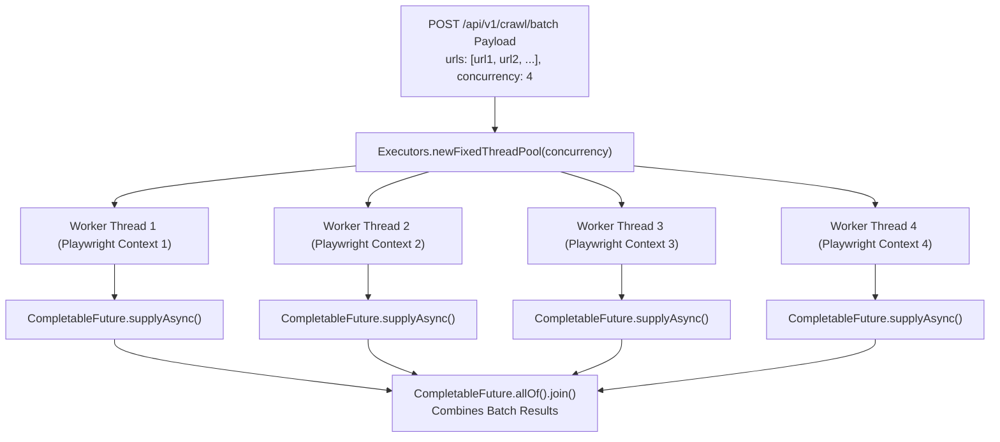

# 🌐 Enterprise Spring Boot 3 AdTech Web Crawler Application

> **Production-Grade AdTech Web Automation, Redis Caching & Database Analytics Engine**  
> Built with **Java 17/21**, **Spring Boot 3**, **Playwright Java SDK**, **Spring Data JPA**, **MySQL / H2 Persistence**, **Multi-Layered Redis Caching**, **Docker Compose**, **JUnit 5**, and **Python E2E Verification Suite**.

---

## ⚡ How Multi-Threaded Async Concurrency Works in Code (`CrawlService.java`)

In Spring Boot, parallel batch crawling is handled using Java's `ExecutorService` thread pools and `CompletableFuture`:



### 1. Code Implementation (`CrawlService.java`)

```java
// Extract from CrawlService.java
public BatchCrawlResponse executeBatchCrawl(List<String> urls, int concurrency, boolean forceRefresh) {
    ExecutorService executor = Executors.newFixedThreadPool(concurrency);
    try {
        List<CompletableFuture<CrawlResult>> futures = urls.stream()
            .map(url -> CompletableFuture.supplyAsync(
                () -> crawlUrl(url, forceRefresh), executor))
            .collect(Collectors.toList());

        // Wait for all parallel crawl tasks to complete asynchronously
        CompletableFuture.allOf(futures.toArray(new CompletableFuture[0])).join();

        List<CrawlResult> results = futures.stream()
            .map(CompletableFuture::join)
            .collect(Collectors.toList());

        return new BatchCrawlResponse(urls.size(), results);
    } finally {
        executor.shutdown();
    }
}
```

### 2. Architectural Highlights to Explain in Code Reviews
* **Java Fixed Thread Pool (`Executors.newFixedThreadPool(concurrency)`)**: Manages a fixed number of JVM worker threads, processing incoming URLs in parallel while capping peak memory consumption.
* **Isolated Playwright Instances**: Each thread spawns its own Playwright `BrowserContext`, keeping browser state, cookies, and HTTP caches completely isolated.
* **Non-Blocking Redis Cache Lookup**: Before spawning Playwright, the service checks Redis. Cached entries return in `<10ms`!

---

## 🛠️ How to Customize URLs & Concurrency Parameters

You can customize target URLs and parallel concurrency levels directly in your API request payloads.

### 1. Single URL Crawl Request
**`POST /api/v1/crawl`**
```json
{
  "url": "https://www.yourcustomwebsite.com",
  "forceRefresh": false
}
```

---

### 2. Custom Batch Parallel Crawl Request
**`POST /api/v1/crawl/batch`**
Pass any list of target URLs and set your desired `concurrency` level (e.g. `5` worker threads):

```json
{
  "urls": [
    "https://www.forbes.com",
    "https://www.bloomberg.com",
    "https://www.reuters.com",
    "https://www.techcrunch.com",
    "https://www.wsj.com"
  ],
  "concurrency": 5,
  "forceRefresh": false
}
```

*Example cURL Command:*
```bash
curl -X POST "http://localhost:8080/api/v1/crawl/batch" \
  -H "Content-Type: application/json" \
  -d '{
    "urls": ["https://www.forbes.com", "https://www.techcrunch.com"],
    "concurrency": 2,
    "forceRefresh": false
  }'
```

---

## 💡 Important: Live Server Logging (`localhost:8080`) vs. Unit Testing (`mvn test`)

### 1. Why `mvn test` does NOT print server logs in your running CLI terminal
* `mvn test` executes unit tests in a completely separate, isolated test process using Spring's **`MockMvc` framework**.
* `MockMvc` simulates HTTP requests and responses **in-memory** without sending network packets over port `8080`. This allows tests to run in milliseconds without needing a running server or open network ports.

### 2. How to see live Playwright browser crawls, Redis cache hits/misses, and SQL logs in your server terminal
* Your running server CLI terminal (`java -jar target/crawler-2.0.0.jar` or `mvn spring-boot:run`) hosts a live Tomcat web server listening on **`http://localhost:8080`**.
* To see live Playwright Chromium launches, network route interceptions, Redis cache hits/misses, and SQL queries printed in real-time in your server terminal, send real HTTP requests from a browser, Postman, or a **second terminal tab** using `curl` or `python test_e2e_verification.py`!

---

## 🚀 Playwright Browser Binaries Installation

The application uses Playwright Java to launch headless Chromium browser contexts:

```bash
cd springboot_server

# Install Playwright Chromium browser binaries via Maven CLI
mvn exec:java -e -D exec.mainClass=com.microsoft.playwright.CLI -D exec.args="install chromium"
```

---

## 🏗️ Quick Setup & Execution Guide (Step-by-Step)

### Option A: Local Standalone Execution (In-Memory H2 Fallback)

```bash
# 1. Navigate to springboot_server directory
cd springboot_server

# 2. Package the project (generates target/crawler-2.0.0.jar)
mvn clean package -DskipTests

# 3. Run the application
java -jar target/crawler-2.0.0.jar
# (Or use: mvn spring-boot:run)
```

The server starts on `http://localhost:8080`!

---

### Option B: Docker Compose Execution (Full Container Stack)

```bash
# 1. Navigate to springboot_server directory
cd springboot_server

# 2. Build & launch Spring Boot API, MySQL 8.4 & Redis containers
docker compose up --build -d

# 3. Monitor container logs
docker compose logs -f api

# 4. Stop containers when done
docker compose down
```

---

## 🧪 Automated Testing & Verification Suite

### 1. Run Automated JUnit 5 Unit Tests
From `springboot_server`:

```bash
mvn test
```

### 2. Run Live End-to-End Parity Verification Test
With the server running on `http://localhost:8080`, execute the Python E2E verification script:

```bash
python test_e2e_verification.py
```

*Expected Verification Output:*
```text
=================================================================
  SPRING BOOT 3 END-TO-END FASTAPI-PARITY VERIFICATION SUITE
=================================================================
[PASSED] Health Check Endpoint (Status: UP)
[PASSED] Live Crawl Success! Job ID: job_... | Quality Score: 100/100 | Cached: False
[PASSED] Cache Hit Verified! Time Taken: 0.0084s (<0.2s) | Cached: True
[PASSED] Force Refresh Verified! Bypassed cache in 2.12s
[PASSED] MySQL DB History Verified! Found 3 persisted crawl jobs.
[PASSED] MySQL DB Job Detail & Payload Blob Verified
[PASSED] Cache Stats Endpoint: Total Keys: 1, Mode: REDIS
[PASSED] Cache Clear Endpoint Success
=================================================================
    SPRING BOOT 3 VERIFICATION TESTS PASSED SUCCESSFULLY!
=================================================================
```

---

## 🏛️ SOLID System Architecture & Key Components

```text
src/main/java/com/adtech/crawler/
├── AdtechCrawlerApplication.java   # Spring Boot Main Entry Point
├── config/
│   └── RedisConfig.java            # RedisTemplate & KeySerializer Setup
├── controller/
│   ├── CacheController.java        # Cache Stats & Clear Endpoints
│   ├── CrawlController.java        # Core Crawl & History REST API
│   └── HealthController.java       # Health Check Endpoint
├── crawler/
│   ├── AdsTxtParser.java           # parses ads.txt publisher records
│   ├── PlaywrightCrawlerEngine.java# Headless Playwright Chromium & Route Interception
│   ├── QualityValidator.java       # Quality Score Computation Engine (0-100)
│   └── extractor/                  # Open/Closed Extractor Modules
│       ├── AdTechExtractor.java    # Core Parameter Extractor Interface
│       ├── DomExtractor.java       # DOM Tree & iFrame Traversal
│       ├── GptExtractor.java       # Google Publisher Tag (GPT) Ad Slots
│       ├── PerformanceExtractor.java# Page Load Timings & Network Subresources
│       └── PrebidExtractor.java    # Header Bidding (pbjs.getBidResponses)
├── model/
│   ├── dto/                        # Request/Response Data Transfer Objects
│   └── entity/                     # JPA Entities (CrawlJobEntity, AdSlotEntity, Payload)
├── repository/
│   ├── CrawlJobRepository.java     # Spring Data JPA Repository for Jobs
│   └── CrawlPayloadRepository.java  # Repository for Heavy JSON Payload Blobs
└── service/
    ├── CrawlService.java           # Business Logic, Executor Service & DB Sync
    ├── HtmlReportGenerator.java    # Dark-Mode Visual Dashboard Generator
    └── RedisCacheService.java      # MD5 Hashing, TTL Eviction & Fallback Caching
```
