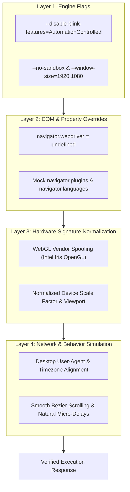

# 🥷 Stealth Browser Automation & Fingerprint Masking Engine

> **Advanced Python Playwright Stealth Architecture Demonstration**  
> Implements **AutomationControlled Blink Flag Patching**, **`navigator.webdriver` Override**, **WebGL Hardware Vendor Normalization**, **Network Response Interception**, and **Behavioral Scroll Humanization**.

---

## ⚡ 5-Layer Browser Stealth Architecture



---

## 🚀 Execution Guide

### Step 1: Install Dependencies
From the workspace root or `stealth_demo/`:

```bash
cd stealth_demo
pip install -r requirements.txt
playwright install chromium
```

### Step 2: Run the Stealth Demonstration Script

Run against standard HTTP header verification endpoint:

```bash
python stealth_crawler.py https://httpbin.org/headers
```

Or run against any neutral test endpoint:

```bash
python stealth_crawler.py https://example.com
```

---

## 🔍 Code Walkthrough & Architectural Components

### 1. Engine Launch Flags (`stealth_crawler.py`)
```python
browser = await p.chromium.launch(
    headless=True,
    args=[
        "--disable-blink-features=AutomationControlled",
        "--no-sandbox",
        "--window-size=1920,1080"
    ]
)
```
* **`--disable-blink-features=AutomationControlled`**: Prevents Chromium from setting internal Blink engine flags that identify the instance as an automated bot.

---

### 2. Browser Initialization Script Injection
```python
await page.add_init_script("""
    Object.defineProperty(navigator, 'webdriver', { get: () => undefined });
    Object.defineProperty(navigator, 'languages', { get: () => ['en-US', 'en'] });
""")
```
* **Init Script Injection**: Runs JavaScript immediately before any target website scripts execute, guaranteeing that `navigator.webdriver` returns `undefined` (matching a real human browser).

---

### 3. Asynchronous Network Interception
```python
async def handle_response(response):
    captured_responses.append({
        "url": response.url,
        "status": response.status,
        "content_type": response.headers.get("content-type", "")
    })

page.on("response", handle_response)
```
* **Non-Blocking Listener**: Asynchronously logs all network traffic, API endpoints, and subresources without pausing page execution.
